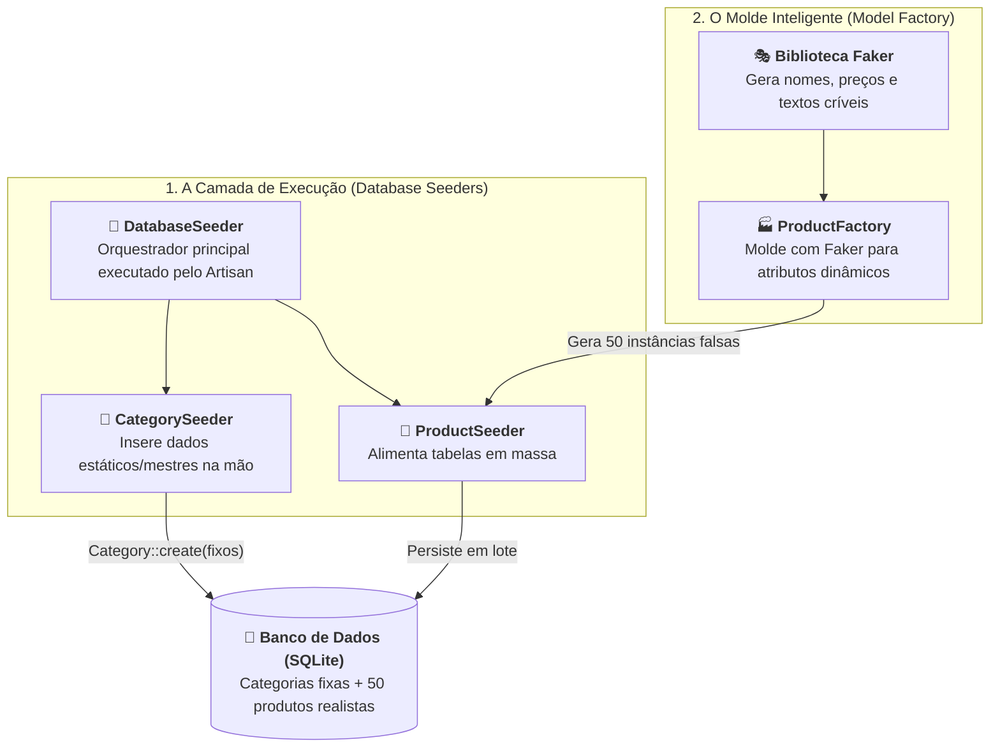

# 04. Seeders e Factories para Testes

No **[Capítulo 03: Migrations e Esquemas de
Banco](03-migrations-e-esquemas-de-banco.md)**, aprendemos a utilizar as
Migrations para versionar nosso banco de dados com a classe `Blueprint`,
garantindo que qualquer membro da equipe recrie exatamente a mesma estrutura
física de tabelas em segundos.

Contudo, ao executarmos `php artisan migrate`, surge uma pergunta imediata:

> _"As tabelas existem no banco, mas estão completamente vazias. Como
> alimentamos nossa aplicação com dados reais para o sistema funcionar, e como
> geramos centenas de registros fictícios para testar paginações, buscas e
> performance sem ter que digitar nada na mão?"_

No ecossistema do Laravel, a alimentação de dados é resolvida por duas
ferramentas que trabalham em perfeita harmonia: os **Database Seeders** e as
**Model Factories**.

Neste capítulo, você entenderá por que os **Seeders** são a base do povoamento
de banco de dados, aprenderá a cadastrar **dados mestres estáticos** (como
categorias e perfis fixos) e descobrirá como as **Factories** com a biblioteca
**Faker** eliminam o tédio de gerar dados fictícios em massa.

## A Dor: O Banco Vazio e o Povoamento Manual

Quando criamos uma API, deparamo-nos com dois tipos fundamentais de necessidades
de dados:

1. **Dados Mestres (Estruturais):** O sistema simplesmente não opera sem eles.
   Exemplos: perfis de permissão (`"admin"`, `"client"`), status de pedidos
   (`"pendente"`, `"pago"`, `"cancelado"`) ou categorias fixas de produtos
   (`"Eletrônicos"`, `"Móveis"`, `"Livros"`);
2. **Massa de Dados de Teste:** Registros em volume para validar o comportamento
   da aplicação — verificar se a paginação de 15 em 15 itens quebra, testar a
   ordenação por preço ou medir a performance de consultas com centenas de
   itens.

No passado, os desenvolvedores recorriam a abordagens manuais e desgastantes:

- **Cadastrar itens manualmente em telas ou no Tinker:** Digitar formulários
  repetitivos com dados bobos (`"teste 1"`, `"teste 2"`, `"asdasd"`);
- **Scripts SQL avulsos:** Comandos `INSERT INTO` manuais que quebram facilmente
  quando o esquema de tabelas muda;
- **A tragédia do `migrate:fresh`:** Ao resetar o banco de dados com `php
artisan migrate:fresh`, **todos os dados eram perdidos**, obrigando o
  desenvolvedor a cadastrar tudo do zero novamente.

Veja como seria tentar resolver o volume com um script manual primitivo:

```php
<?php
// ❌ CÓDIGO PROBLEMÁTICO / POVOAMENTO MANUAL E FRÁGIL
declare(strict_types=1);

// Dados artificiais, repetitivos, trabalhosos e sem realismo
for ($i = 1; $i <= 50; $i++) {
    Product::create([
        'name'        => 'Produto Genérico ' . $i,
        'description' => 'Descrição de teste número ' . $i,
        'price'       => 10.00 * $i,
        'stock'       => 5,
        'is_active'   => true,
    ]);
}
```

Essa abordagem é frágil: todos os textos têm o mesmo formato previsível, não
testamos casos de borda (como descrições longas, nomes curtos ou produtos com
estoque zero) e misturamos dados que deveriam ser estáticos com dados de teste.

## A Arquitetura do Laravel: Seeders Primeiro, Factories Depois

Para organizar o ciclo de vida dos dados, o Laravel divide as responsabilidades
com clareza cirúrgica:



- **Database Seeders (Os Alimentadores):** São as classes executáveis pelo
  Laravel para semear o banco. Eles são a porta de entrada de qualquer inserção;
- **Model Factories (Os Moldes):** São fábricas auxiliares que os Seeders chamam
  quando precisam de dezenas ou centenas de registros fictícios sem ter que
  escrever loops manuais.

## 1. Database Seeders: Povoando com Dados Estáticos

O **Seeder** é o recurso mais fundamental. Ele é uma classe PHP comum que possui
um único método: `run()`. Tudo o que você colocar dentro de `run()` será
executado ao rodar o comando de seed.

### O Cenário Real: Dados Mestres Criados na Mão

Nem todo dado em um sistema deve ser aleatório. Dados mestres — como categorias
oficiais, planos de assinatura ou o usuário administrador inicial — precisam ser
**estáticos, previsíveis e idênticos em qualquer máquina**.

Nesse cenário, **não usamos Factories nem dados aleatórios**. Usamos o próprio
Eloquent diretamente no Seeder!

Para criar um seeder de categorias:

```bash
php artisan make:seeder CategorySeeder
```

O Laravel criará o arquivo `database/seeders/CategorySeeder.php`. Abrimos esse
arquivo e inserimos nossos dados fixos com `Category::create()`:

```php
<?php
// ✅ CÓDIGO IDIOMÁTICO / RECOMENDADO: Seeder com dados mestres estáticos
declare(strict_types=1);

namespace Database\Seeders;

use App\Models\Category;
use Illuminate\Database\Seeder;

class CategorySeeder extends Seeder
{
    /**
     * Executa as inserções de dados no banco.
     */
    public function run(): void
    {
        $categories = [
            [
                'name'        => 'Eletrônicos',
                'description' => 'Dispositivos, computadores, smartphones e periféricos',
            ],
            [
                'name'        => 'Móveis',
                'description' => 'Cadeiras ergonômicas, mesas de escritório e estantes',
            ],
            [
                'name'        => 'Livros',
                'description' => 'Livros técnicos de computação, engenharia e literatura',
            ],
        ];

        foreach ($categories as $category) {
            Category::create($category);
        }
    }
}
```

Pronto! Sempre que executarmos esse seeder, garantimos que o banco terá
exatamente essas três categorias fundamentais cadastradas.

### O Orquestrador Central: `DatabaseSeeder.php`

Na pasta `database/seeders/`, você observará que o Laravel já entrega um arquivo
pronto chamado **`DatabaseSeeder.php`**. Ele é o maestro da orquestra, o arquivo
que o comando `php artisan db:seed` executa por padrão.

Para registrar nosso `CategorySeeder`, basta chamá-lo dentro do método `run()`
usando `$this->call()`:

```php
<?php

namespace Database\Seeders;

use Illuminate\Database\Seeder;

class DatabaseSeeder extends Seeder
{
    /**
     * Ponto de entrada de todos os seeds da aplicação.
     */
    public function run(): void
    {
        $this->call([
            CategorySeeder::class,
        ]);
    }
}
```

Agora, ao rodar `php artisan db:seed`, o Laravel executará o `CategorySeeder` e
suas categorias estarão salvas no banco de dados!

## 2. A Dor do Volume: Por que Precisamos de Model Factories?

Popular 3 ou 5 categorias na mão é rápido e faz sentido. Mas o que acontece
quando precisamos testar o catálogo de **produtos**?

- Precisamos de **50 produtos** para testar a paginação da nossa API;
- Precisamos de nomes variados para testar filtros de busca;
- Precisamos de preços variados para testar ordenação crescente e decrescente;
- Precisamos de alguns itens com estoque zerado para validar mensagens de
  esgotado.

Digitar 50 arrays na mão no Seeder seria um trabalho braçal exaustivo e
entediante.

É aqui que entram as **Model Factories**! A Factory é o molde inteligente que
ensina ao Laravel como "fabricar" um modelo fictício, combinando o Eloquent com
a biblioteca **Faker**.

## 3. Criando uma Model Factory com a Biblioteca Faker

Para criar uma fábrica para o Model `Product`, executamos:

```bash
php artisan make:factory ProductFactory
```

O Laravel criará o arquivo `database/factories/ProductFactory.php` contendo
apenas o esqueleto vazio:

```php
<?php
// O que o Artisan gera por padrão (esqueleto com array vazio):
namespace Database\Factories;

use Illuminate\Database\Eloquent\Factories\Factory;

class ProductFactory extends Factory
{
    public function definition(): array
    {
        return [
            // 👈 O array vem completamente vazio por padrão!
        ];
    }
}
```

> ⚠️ **Atenção: A Factory precisa ser preenchida manualmente!**
>
> Assim como acontece com as Migrations, o comando `make:factory` cria apenas o
> esqueleto da classe. O Artisan não inspeciona seu banco nem adivinha que tipo
> de produto sua loja vende.
>
> **É você, desenvolvedor**, quem deve abrir o arquivo e preencher o método
> `definition()`, indicando cada atributo do modelo e associando-o a um gerador
> do helper global `fake()`:

```php
<?php
// ✅ CÓDIGO IDIOMÁTICO / RECOMENDADO: Model Factory preenchida manualmente com Faker
declare(strict_types=1);

namespace Database\Factories;

use App\Models\Product;
use Illuminate\Database\Eloquent\Factories\Factory;

/**
 * @extends Factory<Product>
 */
class ProductFactory extends Factory
{
    /**
     * Define o estado padrão do modelo gerado.
     *
     * @return array<string, mixed>
     */
    public function definition(): array
    {
        return [
            // Gera um nome fictício de produto com 3 palavras (ex: "Ergonomic Wooden Chair")
            'name'        => fake()->words(nb: 3, asText: true),

            // Gera uma frase descritiva realista
            'description' => fake()->sentence(nbWords: 10),

            // Gera um preço decimal entre R$ 20,00 e R$ 900,00 com 2 casas decimais
            'price'       => fake()->randomFloat(nbMaxDecimals: 2, min: 20, max: 900),

            // Quantidade de estoque aleatória entre 0 e 100
            'stock'       => fake()->numberBetween(int1: 0, int2: 100),

            // Booleano com 85% de probabilidade de vir true (ativo)
            'is_active'   => fake()->boolean(chanceOfGettingTrue: 85),
        ];
    }
}
```

### O Helper `fake()`

O Laravel inclui nativamente a biblioteca **Faker** por meio da função global
`fake()`. Ela oferece centenas de métodos especializados para gerar dados
extremamente realistas:

- `fake()->name()`: Nomes completos de pessoas;
- `fake()->unique()->safeEmail()`: E-mails válidos e garantidamente únicos;
- `fake()->words(3, true)`: Palavras aleatórias em uma única string;
- `fake()->sentence(10)`: Frase completa com 10 palavras e pontuação;
- `fake()->paragraph()`: Parágrafo completo de texto;
- `fake()->randomFloat(2, 10, 500)`: Valores decimais monetários;
- `fake()->numberBetween(0, 100)`: Números inteiros em um intervalo;
- `fake()->boolean(80)`: Booleano com probabilidade customizada de vir `true`.

### Habilitando a Factory no Model

Para que o Model possa acionar sua fábrica de forma fluente, certifique-se de
que a trait `HasFactory` está presente na classe do Model (o Laravel já inclui
automaticamente quando o Model é criado com `php artisan make:model`):

```php
namespace App\Models;

use Illuminate\Database\Eloquent\Factories\HasFactory;
use Illuminate\Database\Eloquent\Model;

class Product extends Model
{
    use HasFactory; // 👈 Habilita a sintaxe Product::factory()

    protected $fillable = ['name', 'description', 'price', 'stock', 'is_active'];
}
```

### Como a Factory Funciona na Prática

Com a fábrica configurada, gerar dados se torna uma linha de código expressiva:

```php
// Cria 1 produto com dados fictícios e salva no banco de dados
Product::factory()->create();

// Cria 50 produtos diferentes no banco de uma única vez!
Product::factory()->count(50)->create();

// Cria a instância em memória SEM salvar no banco (ótimo para testes unitários rápidos)
$fakeProduct = Product::factory()->make();

// Cria um produto sobrescrevendo atributos pontuais
$specialProduct = Product::factory()->create([
    'name'  => 'Cadeira Gamer Pro',
    'price' => 1299.90,
]);
```

## 4. Integrando Factory ao Seeder

Agora que conhecemos tanto os Seeders quanto as Factories, conectamos as duas
pontas criando um seeder dedicado para produtos de teste:

```bash
php artisan make:seeder ProductSeeder
```

Dentro de `database/seeders/ProductSeeder.php`, simplesmente chamamos a Factory
com o volume desejado:

```php
<?php
// ✅ CÓDIGO IDIOMÁTICO / RECOMENDADO: Seeder delegando volume à Factory
declare(strict_types=1);

namespace Database\Seeders;

use App\Models\Product;
use Illuminate\Database\Seeder;

class ProductSeeder extends Seeder
{
    /**
     * Executa o seed de produtos fictícios.
     */
    public function run(): void
    {
        // Cria 50 produtos com dados gerados pelo Faker
        Product::factory()->count(50)->create();
    }
}
```

E no orquestrador `DatabaseSeeder.php`, encadeamos os dois seeders na ordem
correta (primeiro os dados mestres essenciais, depois os dados de teste):

```php
<?php

namespace Database\Seeders;

use Illuminate\Database\Seeder;

class DatabaseSeeder extends Seeder
{
    public function run(): void
    {
        $this->call([
            CategorySeeder::class, // 1º: Categorias fixas (dados mestres)
            ProductSeeder::class,  // 2º: 50 produtos fictícios (volume para testes)
        ]);
    }
}
```

## O Ciclo de Execução dos Seeds via Artisan

Depois de configurar seus seeders, você pode popular seu banco de dados a
qualquer momento via linha de comando.

### 1. Executando o DatabaseSeeder Completo

```bash
php artisan db:seed
```

Saída no terminal:

```text
  INFO  Seeding database.
  Database\Seeders\CategorySeeder ................................... 15ms DONE
  Database\Seeders\ProductSeeder .................................... 45ms DONE
```

### 2. Executando um Seeder Isolado

Se você quiser rodar apenas um seeder específico sem disparar os demais:

```bash
php artisan db:seed --class=CategorySeeder
```

### 3. O Combo Mais Amado: `migrate:fresh --seed`

Durante a rotina de desenvolvimento, este é o comando que você mais utilizará:

```bash
php artisan migrate:fresh --seed
```

O que acontece nos bastidores em apenas 2 segundos:

1. **`fresh`:** Descarta todas as tabelas existentes no banco de dados;
2. **`migrate`:** Executa todas as migrations do zero, recriando as tabelas com
   a estrutura atualizada;
3. **`--seed`:** Executa imediatamente o `DatabaseSeeder`, inserindo as
   categorias fixas e os 50 produtos de teste gerados pela Factory.

Com um único comando, todo o ambiente de banco é restaurado para um estado
perfeito, consistente e pronto para consumo da API!

## Tabela Resumo: Quando Usar Cada Abordagem

| Cenário de Negócio                   | Ferramenta Ideal               | Como Implementar                                 |
| :----------------------------------- | :----------------------------- | :----------------------------------------------- |
| **Dados Mestres / Estruturais**      | **Seeder com Eloquent direto** | `Category::create(['name' => 'Eletrônicos'])`    |
| **Perfis e Permissões do Sistema**   | **Seeder com Eloquent direto** | `Role::create(['slug' => 'admin'])`              |
| **Usuário Administrador Inicial**    | **Seeder com dados fixos**     | `User::create(['email' => 'admin@empresa.com'])` |
| **Volume de Teste para Paginação**   | **Seeder + Model Factory**     | `Product::factory()->count(50)->create()`        |
| **Massa Aleatória para Stress Test** | **Seeder + Model Factory**     | `Order::factory()->count(200)->create()`         |
| **Reset Completo do Ambiente**       | **Artisan CLI**                | `php artisan migrate:fresh --seed`               |

> **Regra de Ouro:**
>
> - **Dados Estruturais (Mestres):** Devem ser inseridos de forma determinística
>   (fixa) no Seeder, pois o sistema depende de IDs e nomes exatos para suas
>   regras de negócio.
> - **Dados Fictícios de Teste (Factories):** Devem ser utilizados
>   **exclusivamente em ambiente local e em testes automatizados**. Nunca
>   execute factories com geradores aleatórios em bancos de dados de produção!

<details>
<summary>🔍 Aprofundamento Técnico: Estados de Fábrica (Factory States)</summary>

Em aplicações reais, uma mesma entidade pode assumir estados de negócio bem
distintos. Por exemplo, um produto pode estar **em estoque** ou **esgotado**; um
usuário pode ser um **cliente comum** ou um **administrador**.

Em vez de criar lógicas condicionais complexas nos seus testes, o Laravel
permite definir métodos especiais na sua Factory chamados **Estados**
(_States_):

```php
// Dentro de database/factories/ProductFactory.php:

/**
 * Indica que o produto está totalmente esgotado no estoque.
 */
public function outOfStock(): static
{
    return $this->state(fn (array $attributes) => [
        'stock'     => 0,
        'is_active' => false,
    ]);
}

/**
 * Indica que o produto é um item premium de alto valor.
 */
public function premium(): static
{
    return $this->state(fn (array $attributes) => [
        'price' => fake()->randomFloat(2, 2000, 5000),
    ]);
}
```

Agora você pode combinar estados com altíssima expressividade:

```php
// Cria 5 produtos com valores normais da factory
Product::factory()->count(5)->create();

// Cria 3 produtos explicitamente esgotados para testar filtros de estoque zero
Product::factory()->count(3)->outOfStock()->create();

// Cria 2 produtos premium
Product::factory()->count(2)->premium()->create();
```

Essa fluência transforma a escrita de cenários de teste em uma experiência
limpa, legível e altamente sustentável.

</details>

## O Que Vem a Seguir?

Agora nosso banco de dados está completo: temos as tabelas versionadas por
**Migrations**, o Model mapeado pelo **Eloquent**, dados mestres fixos e
centenas de dados de teste realistas gerados por **Seeders e Factories**.

No entanto, no mundo real, as entidades raramente vivem isoladas:

- Um produto **pertence a uma** categoria;
- Uma categoria **possui muitos** produtos;
- Um pedido possui vários itens.

> _"Como relacionar tabelas no Laravel e consultar dados associados sem precisar
> escrever comandos SQL complexos com `JOIN`?"_

No **[Capítulo 05: Relacionamentos no Eloquent e
JOINs](05-relacionamentos-no-eloquent-e-joins.md)**, exploraremos os
relacionamentos fundamentais `hasMany` (um para muitos) e `belongsTo` (muitos
para um), descobrindo como o Eloquent substitui JOINs manuais por métodos
expressivos e intuitivos!

---

<a href="03-migrations-e-esquemas-de-banco.md">← Migrations e Esquemas de
Banco</a>

<p align="right"><a href="05-relacionamentos-no-eloquent-e-joins.md">Próximo: Relacionamentos no Eloquent e JOINs →</a></p>
