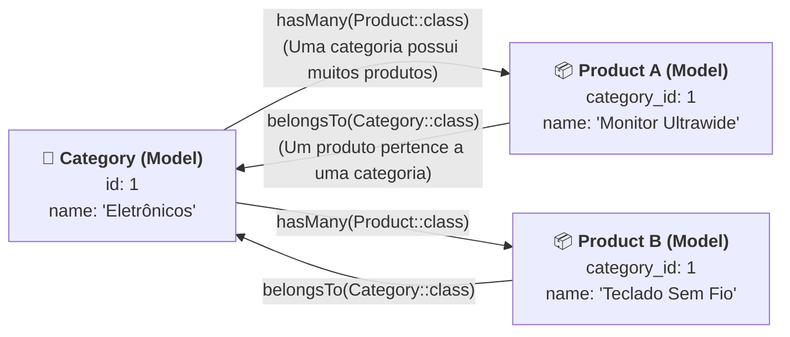
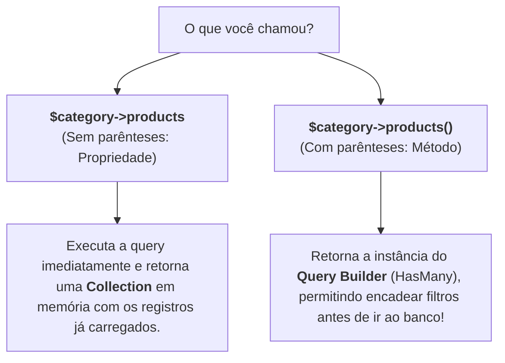

# 05. Relacionamentos no Eloquent e JOINs

No **[Capítulo 04: Seeders e Factories para
Testes](04-seeders-e-factories-para-testes.md)**, aprendemos a alimentar nosso
banco de dados com dados mestres estáticos e grandes volumes de dados fictícios
gerados pelo Faker.

Até agora, manipulamos o Model `Product` de forma isolada. Contudo, em qualquer
sistema real de backend, os dados estão profundamente interligados:

- Um produto **pertence a uma** categoria;
- Uma categoria **possui muitos** produtos;
- Um pedido é feito por um usuário e contém múltiplos itens.

No modelo relacional tradicional (SQL), essas conexões são feitas por meio de
**Chaves Estrangeiras** (_Foreign Keys_) e consultadas através de cláusulas
`JOIN`. No mundo da Orientação a Objetos, porém, pensar em IDs e tabelas
separadas quebra a fluência do código.

> _"Como consultar os produtos de uma categoria ou descobrir a categoria de um
> produto navegando diretamente pelos objetos no PHP, sem precisar escrever
> comandos SQL `JOIN` gigantes e propensos a erro?"_

Neste capítulo, você aprenderá como o **Eloquent ORM** traduz conceitos de banco
de dados para métodos expressivos em PHP utilizando os relacionamentos
fundamentais **`hasMany`** e **`belongsTo`**, além de dominar a técnica de
**Eager Loading (`with`)** para exterminar o temido gargalo de performance
conhecido como **problema do N+1**.

## A Dor: O Modelo Relacional vs O Paradigma Orientado a Objetos

Imagine que você precise listar 10 produtos e exibir o nome da categoria de cada
um. Sem um ORM moderno, o desenvolvedor precisa escrever comandos SQL manuais
com `INNER JOIN`:

```sql
-- SQL tradicional: verboso, acoplado ao esquema físico e propenso a conflito de colunas
SELECT
    products.id,
    products.name AS product_name,
    products.price,
    categories.id AS category_id,
    categories.name AS category_name
FROM products
INNER JOIN categories ON categories.id = products.category_id;
```

Essa abordagem traz desafios imediatos:

1. **Conflito de Nomes de Coluna:** Ambas as tabelas possuem colunas chamadas
   `id` e `name`. O desenvolvedor é obrigado a criar apelidos (`AS
product_name`, `AS category_name`) para evitar que uma coluna sobrescreva a
   outra no array de resultado;
2. **Perda da Identidade dos Objetos:** O resultado retornado pelo driver do
   banco é uma matriz plana (linhas e colunas), perdendo todos os métodos e
   comportamentos ricos que as classes `Product` e `Category` possuem;
3. **Manutenção Complexa:** Se a chave estrangeira mudar de nome ou se novas
   tabelas entrarem na consulta, todas as queries `JOIN` espalhadas pelo sistema
   precisam ser reescritas manualmente.

### Como Pensamos na Orientação a Objetos

No paradigma de objetos, nós não queremos lidar com ponteiros de chave inteira
(`$product->category_id`). Nós queremos navegar naturalmente pelas propriedades
dos objetos:

```php
// O que queremos no PHP:
echo $product->name;           // "Teclado Mecânico"
echo $product->category->name; // "Eletrônicos" (navegação fluente pelo objeto associado!)
```

O Eloquent torna exatamente isso possível através dos **métodos de
relacionamento**.

## A Base Relacional: A Chave Estrangeira na Migration

Para que dois modelos possam se relacionar, o banco de dados físico precisa
armazenar o vínculo. Como vimos no capítulo de Migrations, utilizamos o método
`foreignId()` com a restrição `constrained()` na tabela `products`:

```php
// database/migrations/2026_09_20_000002_create_products_table.php

Schema::create('products', function (Blueprint $table) {
    $table->id();
    // Cria a coluna category_id referenciando a tabela categories
    $table->foreignId('category_id')->constrained()->cascadeOnDelete();
    $table->string('name');
    $table->text('description')->nullable();
    $table->decimal('price', 10, 2);
    $table->integer('stock')->default(0);
    $table->boolean('is_active')->default(true);
    $table->timestamps();
});
```

Com a chave estrangeira criada no banco de dados, configuramos as duas pontas do
relacionamento no PHP:



## 1. O Lado "Muitos para Um": `belongsTo` no Model `Product`

Como cada produto pertence a apenas uma categoria, o Model `Product` deve
declarar um método com o nome da relação no **singular**: `category()`.

Dentro do método, retornamos `$this->belongsTo(Category::class)`:

```php
<?php
// ✅ CÓDIGO IDIOMÁTICO / RECOMENDADO: Model com relacionamento belongsTo
declare(strict_types=1);

namespace App\Models;

use Illuminate\Database\Eloquent\Factories\HasFactory;
use Illuminate\Database\Eloquent\Model;
use Illuminate\Database\Eloquent\Relations\BelongsTo;

class Product extends Model
{
    use HasFactory;

    protected $fillable = [
        'category_id',
        'name',
        'description',
        'price',
        'stock',
        'is_active',
    ];

    /**
     * Define o relacionamento: Um produto pertence a uma categoria.
     */
    public function category(): BelongsTo
    {
        return $this->belongsTo(Category::class);
    }
}
```

### Convenções do Eloquent para `belongsTo`

Por convenção, o Eloquent inspeciona o nome do método (`category`) e busca
automaticamente uma coluna chamada `<metodo>_id` na tabela `products` (neste
caso, `category_id`). Ele conecta essa chave estrangeira à coluna `id` da tabela
`categories`. Você não precisa configurar nada a mais!

### Acessando a Categoria no Dia a Dia

Uma vez declarado o método, você pode acessar a categoria associada como se ela
fosse uma **propriedade comum** do objeto:

```php
$product = Product::find(1);

// O Eloquent carrega o Model Category correspondente automaticamente:
echo $product->name;           // "Monitor Gamer 27"
echo $product->category->name; // "Eletrônicos"
```

## 2. O Lado "Um para Muitos": `hasMany` no Model `Category`

Agora olhamos pelo ponto de vista inverso: uma categoria pode conter vários
produtos cadastrados. No Model `Category`, declaramos um método com o nome da
relação no **plural**: `products()`.

Dentro do método, retornamos `$this->hasMany(Product::class)`:

```php
<?php
// ✅ CÓDIGO IDIOMÁTICO / RECOMENDADO: Model com relacionamento hasMany
declare(strict_types=1);

namespace App\Models;

use Illuminate\Database\Eloquent\Factories\HasFactory;
use Illuminate\Database\Eloquent\Model;
use Illuminate\Database\Eloquent\Relations\HasMany;

class Category extends Model
{
    use HasFactory;

    protected $fillable = [
        'name',
        'description',
    ];

    /**
     * Define o relacionamento: Uma categoria possui muitos produtos.
     */
    public function products(): HasMany
    {
        return $this->hasMany(Product::class);
    }
}
```

### Acessando os Produtos de uma Categoria

Ao acessar `$category->products`, o Eloquent retorna uma **`Collection`**
contendo todos os modelos `Product` que apontam para essa categoria:

```php
$category = Category::find(1);

// Itera sobre todos os produtos daquela categoria
foreach ($category->products as $product) {
    echo "- {$product->name} (R$ {$product->price})\n";
}
```

## A Diferença Crucial: Propriedade Dinâmica vs Método de Consulta

Esta é uma das dúvidas mais frequentes de desenvolvedores que estão começando no
Laravel:

> _"Qual é a diferença entre acessar `$category->products` (sem parênteses) e
> `$category->products()` (com parênteses)?"_

A regra é simples e elegante:



### 1. Sem Parênteses (`$category->products`): Propriedade Dinâmica

Retorna a coleção de modelos já carregada do banco:

```php
// Retorna uma Collection com todos os produtos da categoria
$products = $category->products;

echo $products->count(); // 15 produtos
```

### 2. Com Parênteses (`$category->products()`): Construtor de Consulta

Retorna o Query Builder do relacionamento. Isso permite **adicionar condições
extras de SQL** antes de disparar a consulta ao banco de dados:

```php
// Queremos apenas os produtos ATIVOS e com preço acima de R$ 100,00:
$expensiveProducts = $category->products()
    ->where('is_active', true)
    ->where('price', '>', 100.00)
    ->orderBy('price', 'desc')
    ->get(); // 👈 Só vai ao banco agora com os filtros aplicados no SQL!
```

> 💡 **Dica de Ouro:**
>
> Se você precisa de **todos** os registros para iterar, use a propriedade sem
> parênteses (`$category->products`). Se precisa **filtrar, ordenar ou paginar**
> os dados no próprio banco antes de trazer para o PHP, chame o método com
> parênteses (`$category->products()->where(...)->get()`).

## O Gargalo do N+1 e a Solução: Eager Loading com `with()`

Por padrão, o Eloquent utiliza uma estratégia chamada **Lazy Loading**
(carregamento preguiçoso). Isso significa que os dados relacionados só são
buscados no banco no exato instante em que você acessa a propriedade.

Embora pareça conveniente, o Lazy Loading esconde a armadilha de performance
mais perigosa do desenvolvimento web: **o problema das N+1 consultas**.

### O Problema do N+1 na Prática

Imagine que você queira exibir uma listagem com 30 produtos e o nome de suas
respectivas categorias:

```php
// ❌ CÓDIGO PROBLEMÁTICO: Dispara o problema das N+1 queries
$products = Product::all(); // 1 query: Busca todos os 30 produtos

foreach ($products as $product) {
    // Para CADA um dos 30 produtos, uma nova query é disparada para buscar a categoria:
    echo "{$product->name} - Categoria: {$product->category->name}\n";
}
```

Veja o desastre que aconteceu no seu banco de dados:

1. **1 consulta** inicial para buscar os produtos:  
   `SELECT * FROM products;`
2. **30 consultas individuais** (uma para cada produto) para buscar a categoria:  
   `SELECT * FROM categories WHERE id = 1 LIMIT 1;`  
   `SELECT * FROM categories WHERE id = 2 LIMIT 1;`  
   `SELECT * FROM categories WHERE id = 1 LIMIT 1;`  
   ... (repetido 30 vezes!)

**Total:** $1 + 30 = 31$ requisições ao banco de dados para listar míseros 30
itens! Se fossem 500 produtos, seriam 501 consultas. Em servidores de produção,
isso esgota as conexões do banco e derruba a API.

### A Solução Idiomática: Eager Loading (`with()`)

Para resolver isso de forma definitiva, usamos o método **`with()`** do
Eloquent. Essa técnica é chamada de **Eager Loading** (carregamento antecipado):

```php
// ✅ CÓDIGO IDIOMÁTICO / RECOMENDADO: Eager Loading com with()
$products = Product::with('category')->get();

foreach ($products as $product) {
    // Os dados da categoria já estão em memória! Nenhuma query extra é disparada:
    echo "{$product->name} - Categoria: {$product->category->name}\n";
}
```

O Eloquent é inteligente. Ele resolve a consulta inteira com apenas **duas
queries otimizadas**, não importa se você está buscando 10 ou 10.000 produtos:

```sql
-- Query 1: Busca todos os produtos
SELECT * FROM products;

-- Query 2: Coleta todos os category_id únicos e busca tudo de uma vez via IN!
SELECT * FROM categories WHERE id IN (1, 2, 5, 8);
```

Depois, o próprio Eloquent monta e conecta os objetos em memória
instantaneamente. A aplicação passa de **31 consultas lentas** para **apenas 2
consultas ultra velozes**!

### Carregando Múltiplos Relacionamentos

Você pode carregar múltiplos relacionamentos passando um array para o `with()`:

```php
// Carrega a categoria e os itens relacionados de uma só vez
$products = Product::with(['category', 'tags', 'supplier'])->get();
```

## Inserindo Registros Relacionados de Forma Fluente

O Eloquent também simplifica a inserção de novos registros vinculados.

Em vez de pegar o ID manualmente e passar para o `create()`, você pode criar um
produto diretamente a partir da categoria:

```php
$category = Category::find(1);

// O Eloquent preenche o category_id automaticamente!
$newProduct = $category->products()->create([
    'name'        => 'Mouse Sem Fio Ergonômico',
    'description' => 'Sensor óptico de alta precisão',
    'price'       => 189.90,
    'stock'       => 25,
    'is_active'   => true,
]);
```

Essa fluência torna o código expressivo, limpo e à prova de esquecimentos de
chaves estrangeiras.

## Tabela de Métodos e Boas Práticas

| Operação                         | Sintaxe Recomendada                                    | Comportamento / Benefício                                |
| :------------------------------- | :----------------------------------------------------- | :------------------------------------------------------- |
| **Declarar N:1 (Pertence)**      | `public function category(): BelongsTo`                | Usa `$this->belongsTo(Category::class)` no Model filho   |
| **Declarar 1:N (Possui Muitos)** | `public function products(): HasMany`                  | Usa `$this->hasMany(Product::class)` no Model pai        |
| **Obter Registros Carregados**   | `$category->products`                                  | Retorna `Collection` já em memória (propriedade)         |
| **Filtrar Relação no Banco**     | `$category->products()->where('stock', '>', 0)->get()` | Retorna `QueryBuilder` com filtros aplicados no SQL      |
| **Evitar Gargalo N+1**           | `Product::with('category')->get()`                     | Faz apenas 2 queries otimizadas (`WHERE id IN (...)`)    |
| **Criar Registro Vinculado**     | `$category->products()->create([...])`                 | Injeta automaticamente a chave estrangeira `category_id` |

<details>
<summary>🔍 Aprofundamento Técnico: Relacionamentos 1:1 e N:N (Muitos para Muitos)</summary>

Além de `1:N` e `N:1`, o Eloquent oferece suporte nativo para outros dois tipos
essenciais de associação:

### 1. Um para Um (`hasOne`)

Usado quando uma entidade possui exatamente uma extensão ou perfil associado.
Por exemplo, um `User` possui um `Profile`:

```php
// No Model User:
public function profile(): HasOne
{
    return $this->hasOne(Profile::class);
}

// No Model Profile:
public function user(): BelongsTo
{
    return $this->belongsTo(User::class);
}
```

### 2. Muitos para Muitos (`belongsToMany`) com Tabela Pivô

Usado quando um produto pode pertencer a várias tags e uma tag pode ter vários
produtos associados. No banco de dados relacional, esse padrão exige uma tabela
intermediária (tabela pivô), como `product_tag` contendo `product_id` e
`tag_id`.

No Eloquent, ambas as pontas usam `belongsToMany`:

```php
// No Model Product:
public function tags(): BelongsToMany
{
    return $this->belongsToMany(Tag::class);
}

// No Model Tag:
public function products(): BelongsToMany
{
    return $this->belongsToMany(Product::class);
}
```

Para associar ou desassociar tags sem escrever SQL manual:

```php
$product = Product::find(1);

// Associa as tags com ID 3 e 5 ao produto na tabela pivô:
$product->tags()->attach([3, 5]);

// Sincroniza (remove as que não estão no array e adiciona as novas):
$product->tags()->sync([1, 2]);
```

Essa simplicidade é um dos maiores trunfos da arquitetura do Eloquent.

</details>

## O Que Vem a Seguir?

Parabéns! Você concluiu com sucesso todo o submódulo de **ORM & Banco de Dados**
do Laravel:

1. Compreendeu a arquitetura de **Models e Entidades** no Active Record;
2. Dominou as operações de CRUD, `$fillable` e proteção de segurança no
   **Eloquent ORM**;
3. Versionou a infraestrutura do banco de dados com **Migrations** agnósticas;
4. Povoou ambientes de forma profissional com **Seeders** e **Model Factories**;
5. E interligou modelos com elegância e alta performance utilizando
   **Relacionamentos** e **Eager Loading**.

Agora temos nosso modelo de dados completo, estruturado e alimentado. Mas como
os clientes da nossa API (aplicações React, mobile ou outros serviços) interagem
com tudo isso através da Web?

No próximo submódulo, iniciaremos a construção dos endpoints HTTP da nossa API!

No **[Capítulo 01: Rotas de API e Verbos
HTTP](../rotas-e-controllers/01-rotas-de-api-e-verbos-http.md)**, aprenderemos a
estruturar o arquivo `routes/api.php`, mapear os verbos fundamentais (GET, POST,
PUT, DELETE) e receber parâmetros na URL.

---

<a href="04-seeders-e-factories-para-testes.md">← Seeders e Factories para
Testes</a>

<p align="right"><a href="../rotas-e-controllers/01-rotas-de-api-e-verbos-http.md">Próximo: Rotas de API e Verbos HTTP →</a></p>
