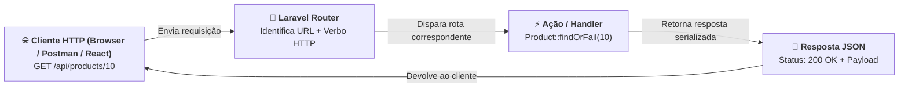
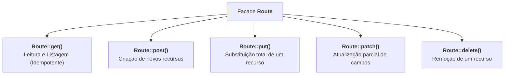

# 01. Rotas de API e Verbos HTTP

No **[Capítulo 05: Relacionamentos no Eloquent e
JOINs](../orm-e-banco-de-dados/05-relacionamentos-no-eloquent-e-joins.md)**,
concluímos a base de dados da nossa aplicação: aprendemos a versionar tabelas,
alimentar registros com Seeders e Factories e navegar entre entidades com
`hasMany` e `belongsTo`.

No entanto, até este momento, todas as interações com nossos modelos foram
feitas via terminal ou testes internos.

Para que aplicações frontend (como Single Page Applications em React),
aplicativos móveis ou outros servidores consumam nossos dados, nossa aplicação
precisa abrir portas de comunicação na rede: os chamados **Endpoints HTTP**.

> _"Como o Laravel recebe uma requisição HTTP vinda da internet (como um `GET
/api/products`), identifica qual ação deve ser tomada e devolve os dados em
> formato JSON com o código de status HTTP correto?"_

Neste capítulo, você aprenderá a habilitar o suporte a APIs no **Laravel 11**,
dominará a declaração de rotas com a facade `Route`, entenderá o papel de cada
**verbo HTTP** (GET, POST, PUT, PATCH e DELETE) e descobrirá como capturar
parâmetros dinâmicos a partir da URL.

## A Dor: O Roteamento Manual em PHP Tradicional

Antes da popularização de frameworks modernos, criar rotas para uma API em PHP
puro exigia inspecionar variáveis superglobais do servidor (`$_SERVER`) com
estruturas condicionais complexas:

```php
<?php
// ❌ CÓDIGO PROBLEMÁTICO / ROTEAMENTO MANUAL EM PHP PURO
$uri = parse_url($_SERVER['REQUEST_URI'], PHP_URL_PATH);
$method = $_SERVER['REQUEST_METHOD'];

// Roteamento manual frágil, verboso e sujeito a erros
if ($uri === '/api/products' && $method === 'GET') {
    header('Content-Type: application/json');
    echo json_encode(Product::all());
    exit;
}

if (preg_match('#^/api/products/(\d+)$#', $uri, $matches)) {
    $productId = $matches[1];

    if ($method === 'GET') {
        header('Content-Type: application/json');
        echo json_encode(Product::find($productId));
        exit;
    }

    if ($method === 'DELETE') {
        // Lógica manual de deleção...
    }
}
```

Essa abordagem torna-se insustentável rapidamente:

1. **Expressões Regulares Complexas:** Extrair parâmetros (`/products/42`) exige
   montar regex manuais que quebram com facilidade;
2. **Mistura de Responsabilidades:** O mesmo arquivo precisa verificar método
   HTTP, manipular headers de resposta, tratar códigos de erro e instanciar
   banco de dados;
3. **Falta de Padronização:** Cada endpoint acaba tratando respostas, erros e
   middlewares de forma divergente.

### A Solução do Laravel: Roteamento Declarativo

O Laravel substitui toda essa complexidade por uma API fluente e declarativa:



Você diz ao framework: _"Quando chegar uma requisição com o método **X** na URL
**Y**, execute a função **Z**"_.

## Habilitando Rotas de API no Laravel 11 (`install:api`)

No **Laravel 11**, o framework adotou uma arquitetura ultraleve e minimalista
por padrão. Ao criar um novo projeto, ele vem pré-configurado apenas para rotas
Web tradicionais (`routes/web.php`).

> ⚠️ **Importante: Cadê o arquivo `routes/api.php`?**
>
> Não se assuste se você abrir um projeto recém-instalado do Laravel 11 e não
> encontrar o arquivo `routes/api.php` na pasta `routes/`.
>
> Para adicionar o suporte a APIs REST na aplicação, executamos o comando
> Artisan:
>
> ```bash
> php artisan install:api
> ```
>
> O que esse comando faz automaticamente:
>
> 1. **Cria o arquivo `routes/api.php`** com o esqueleto inicial de rotas;
> 2. **Configura o arquivo `bootstrap/app.php`**, registrando as rotas de API
>    com o prefixo automático `/api` e o grupo de middlewares `api` (stateless,
>    sem sessões em cookies, otimizado para JSON);
> 3. **Instala o pacote Laravel Sanctum** para futura autenticação via tokens.
>
> Pronto! Agora você tem o ambiente ideal e homologado para construir sua API
> REST.

## Os Verbos HTTP Fundamentais no Laravel

O protocolo HTTP define que cada requisição deve carregar um **Método** (ou
**Verbo**) que indica a intenção semântica do cliente.

O Laravel fornece métodos específicos na facade `Route` correspondentes a cada
verbo HTTP:



Vejamos como declarar cada um deles dentro de `routes/api.php`:

### 1. `Route::get()` — Leitura e Consulta

Utilizado para consultar recursos sem alterar o estado do servidor.

```php
use App\Models\Product;
use Illuminate\Support\Facades\Route;

// Retorna todos os produtos cadastrados
Route::get('/products', function () {
    return response()->json(Product::all(), 200);
});
```

> 💡 **Nota de Conforto do Laravel:** Se você retornar um Model Eloquent ou uma
> Collection diretamente de uma rota (`return Product::all();`), o Laravel
> automaticamente converte para JSON e define o status `200 OK` e o header
> `Content-Type: application/json`.

### 2. `Route::post()` — Criação de Recursos

Utilizado para criar novos registros no banco de dados. Deve retornar o código
**`201 Created`**:

```php
use Illuminate\Http\Request;

Route::post('/products', function (Request $request) {
    // Cria o produto com os dados recebidos no corpo da requisição JSON
    $product = Product::create([
        'category_id' => $request->input('category_id'),
        'name'        => $request->input('name'),
        'description' => $request->input('description'),
        'price'       => $request->input('price'),
        'stock'       => $request->input('stock', 0),
        'is_active'   => $request->input('is_active', true),
    ]);

    // Retorna o produto recém-criado com status 201 Created
    return response()->json($product, 201);
});
```

### 3. `Route::put()` e `Route::patch()` — Atualização

- **`PUT`:** Representa a substituição completa do recurso existente;
- **`PATCH`:** Representa a alteração parcial de apenas alguns atributos
  específicos (por exemplo, atualizar apenas o preço ou apenas o estoque).

```php
Route::patch('/products/{id}', function (Request $request, int $id) {
    $product = Product::findOrFail($id);

    // Atualiza apenas os campos que foram enviados na requisição
    $product->update($request->only(['price', 'stock', 'is_active']));

    return response()->json($product, 200);
});
```

### 4. `Route::delete()` — Remoção de Recursos

Utilizado para excluir um recurso do sistema. O padrão REST costuma retornar o
status **`204 No Content`** (sucesso sem corpo de resposta) ou **`200 OK`** com
uma mensagem de confirmação:

```php
Route::delete('/products/{id}', function (int $id) {
    $product = Product::findOrFail($id);
    $product->delete();

    // 204 No Content indica sucesso absoluto sem necessidade de devolver dados no corpo
    return response()->noContent();
});
```

## Captura de Parâmetros na URL

Para identificar um recurso específico em uma API REST, colocamos o
identificador na própria URL (ex: `/api/products/15`).

No Laravel, qualquer segmento cercado por chaves `{}` torna-se um **parâmetro
dinâmico** injetado automaticamente como argumento da função:

```php
// O parâmetro {id} é repassado diretamente para a variável $id
Route::get('/products/{id}', function (int $id) {
    $product = Product::findOrFail($id);

    return response()->json($product);
});
```

### Múltiplos Parâmetros

Se a rota possuir múltiplos segmentos dinâmicos, eles são repassados na mesma
ordem:

```php
// Exemplo: /api/categories/2/products/10
Route::get('/categories/{categoryId}/products/{productId}', function (int $categoryId, int $productId) {
    $product = Product::where('category_id', $categoryId)
        ->findOrFail($productId);

    return response()->json($product);
});
```

### Restringindo Parâmetros com Regex

Para evitar que requisições com formatos inválidos cheguem à sua lógica (por
exemplo, alguém tentar acessar `/api/products/banana` quando o ID deve ser
estritamente numérico), o Laravel permite aplicar restrições na própria rota:

```php
// ✅ Restringe o parâmetro {id} a aceitar apenas dígitos numéricos
Route::get('/products/{id}', function (int $id) {
    return Product::findOrFail($id);
})->whereNumber('id');

// ✅ Restringe parâmetros a aceitar apenas letras do alfabeto
Route::get('/products/category/{slug}', function (string $slug) {
    // ...
})->whereAlpha('slug');
```

Se o cliente requisitar `/api/products/banana`, o Laravel retornará
imediatamente um erro **404 Not Found**, poupando seu banco de dados de
consultas inúteis!

## Organização e Agrupamento de Rotas

À medida que a aplicação cresce, é comum ter múltiplos endpoints que
compartilham o mesmo prefixo ou configurações comuns. O método `Route::prefix()`
evita repetição desnecessária de código:

```php
// ✅ Agrupamento limpo e organizado por recurso
Route::prefix('/products')->group(function () {
    Route::get('/', function () {
        return Product::all();
    });

    Route::post('/', function (Request $request) {
        return Product::create($request->all());
    });

    Route::get('/{id}', function (int $id) {
        return Product::findOrFail($id);
    })->whereNumber('id');

    Route::delete('/{id}', function (int $id) {
        Product::findOrFail($id)->delete();
        return response()->noContent();
    })->whereNumber('id');
});
```

## A Ferramenta Indispensável: `php artisan route:list`

Como saber quais rotas estão registradas no seu sistema, quais verbos elas
aceitam e quais URLs foram montadas?

O Artisan possui o comando `route:list`, essencial para o dia a dia do
desenvolvedor backend:

```bash
php artisan route:list --path=api
```

Saída no terminal:

```text
  GET|HEAD        api/products ..............................................
  POST            api/products ..............................................
  GET|HEAD        api/products/{id} .........................................
  PATCH           api/products/{id} .........................................
  DELETE          api/products/{id} .........................................
```

Esse comando é o seu mapa de navegação para inspecionar, auditar e debugar
quaisquer rotas da sua aplicação.

## Tabela de Verbos HTTP e Status Codes Recomendados

| Verbo HTTP   | Rota Típica          | Ação Semântica                     | Status Code de Sucesso        |
| :----------- | :------------------- | :--------------------------------- | :---------------------------- |
| **`GET`**    | `/api/products`      | Listar recursos                    | `200 OK`                      |
| **`GET`**    | `/api/products/{id}` | Obter detalhes de um único recurso | `200 OK` (ou `404 Not Found`) |
| **`POST`**   | `/api/products`      | Criar um novo recurso              | `201 Created`                 |
| **`PUT`**    | `/api/products/{id}` | Substituir o recurso por completo  | `200 OK`                      |
| **`PATCH`**  | `/api/products/{id}` | Atualizar campos específicos       | `200 OK`                      |
| **`DELETE`** | `/api/products/{id}` | Excluir o recurso permanentemente  | `204 No Content` ou `200 OK`  |

<details>
<summary>🔍 Aprofundamento Técnico: Rotas Globais com Route::match e Route::any</summary>

Em cenários específicos de integração ou webhooks de parceiros externos, você
pode precisar que uma mesma URL aceite mais de um verbo HTTP ou qualquer verbo
disparado:

```php
// Aceita tanto GET quanto POST no mesmo endpoint
Route::match(['get', 'post'], '/webhook/payment', function (Request $request) {
    // Processa a notificação do gateway de pagamento
});

// Aceita qualquer verbo HTTP (GET, POST, PUT, DELETE, etc.)
Route::any('/debug/ping', function () {
    return response()->json(['status' => 'pong']);
});
```

> ⚠️ **Aviso de Arquitetura:**
>
> Evite usar `Route::any` ou `Route::match` em endpoints comuns de CRUD. A
> separação explícita de verbos HTTP (`get`, `post`, `put`, `delete`) é a
> espinha dorsal de uma arquitetura REST limpa e previsível.

</details>

## O Que Vem a Seguir?

Neste capítulo, aprendemos a registrar rotas e manipular verbos HTTP utilizando
**funções anônimas** (_Closures_) diretamente dentro de `routes/api.php`.

Para testes rápidos ou endpoints muito pequenos, essa abordagem funciona bem. No
entanto, em aplicações profissionais:

- O arquivo `routes/api.php` ficaria gigantesco com centenas de linhas de
  código;
- Misturar regras de negócio com o mapeamento de URLs viola o princípio de
  responsabilidade única;
- Não é possível utilizar o recurso de **cache de rotas** (`route:cache`) do
  Laravel quando existem Closures anônimas no arquivo de rotas!

> _"Como extrair toda a lógica de negócio dos endpoints para classes dedicadas,
> organizadas e reutilizáveis?"_

No **[Capítulo 02: Controllers e Ações CRUD](02-controllers-e-acoes-crud.md)**,
descobriremos como utilizar os **API Controllers** do Laravel para estruturar
nossa lógica com elegância arquitetural!

---

<a href="../orm-e-banco-de-dados/05-relacionamentos-no-eloquent-e-joins.md">←
Relacionamentos no Eloquent e JOINs</a>

<p align="right"><a href="02-controllers-e-acoes-crud.md">Próximo: Controllers e Ações CRUD →</a></p>
