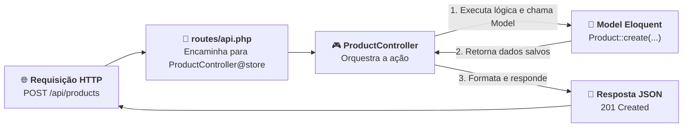

# 02. Controllers e Ações CRUD

No **[Capítulo 01: Rotas de API e Verbos
HTTP](01-rotas-de-api-e-verbos-http.md)**, aprendemos a registrar rotas na
facade `Route`, associando verbos HTTP a funções anônimas (_Closures_) e
capturando parâmetros dinâmicos na URL.

Contudo, ao construirmos uma aplicação comercial com 20 ou 30 endpoints
diferentes, surge um problema evidente de arquitetura:

> _"Se colocarmos a lógica de consulta, validação, persistência e formatação de
> todos os endpoints dentro do arquivo `routes/api.php`, o arquivo ficará com
> milhares de linhas, caótico de manter e impossível de cachear em produção.
> Como organizar cada conjunto de ações em classes limpas e reutilizáveis?"_

No padrão arquitetural **MVC (Model-View-Controller)** adotado pelo Laravel, a
resposta é o **Controller**.

Neste capítulo, você aprenderá a criar **API Controllers** com o Artisan,
entenderá o papel da flag `--api`, implementará os 5 métodos fundamentais do
padrão REST (`index`, `store`, `show`, `update`, `destroy`) e descobrirá o
superpoder do atalho `Route::apiResource()`.

## A Dor: O Arquivo de Rotas Sobrecarregado

Quando iniciamos um projeto, parece cômodo escrever funções anônimas direto no
arquivo de rotas. Veja como fica um pequeno CRUD de produtos com essa abordagem:

```php
<?php
// ❌ CÓDIGO PROBLEMÁTICO: Lógica de negócio misturada no arquivo de rotas
use App\Models\Product;
use Illuminate\Http\Request;
use Illuminate\Support\Facades\Route;

Route::get('/products', function () {
    return Product::with('category')->paginate(10);
});

Route::post('/products', function (Request $request) {
    // 20 linhas de validação e persistência...
});

Route::get('/products/{id}', function (int $id) {
    // Busca e tratamento de erro...
});

Route::put('/products/{id}', function (Request $request, int $id) {
    // Busca, validação e atualização...
});

Route::delete('/products/{id}', function (int $id) {
    // Busca e deleção...
});
```

Essa prática traz três problemas graves:

1. **Violação do Princípio da Responsabilidade Única (SRP):** O arquivo de rotas
   tem apenas uma missão: _mapear URLs para ações_. Quando você coloca regras de
   negócio nele, ele vira um "monólito de rotas";
2. **Impossibilidade de Usar Cache de Rotas (`route:cache`):** O Laravel possui
   um comando de otimização crucial para produção chamado `php artisan
route:cache`, que serializa as rotas em um array estático ultra veloz. Se o seu
   arquivo contiver funções anônimas (Closures), **o comando falha com um
   erro**, pois o PHP não consegue serializar Closures;
3. **Dificuldade de Testes e Reutilização:** Você não consegue instanciar uma
   Closure isoladamente em um teste unitário nem reaproveitar suas lógicas.

## O Papel do Controller na Arquitetura REST

O **Controller** atua como um maestro ou recepcionista inteligente:



O Controller **não** deve conter regras de negócio complexas nem queries SQL
brutas. Sua responsabilidade é estritamente:

1. Receber a requisição HTTP (`Request`);
2. Acionar a camada correta (os Models do Eloquent);
3. Retornar uma resposta HTTP formatada com o status code adequado (`Response`).

## Gerando um API Controller com o Artisan

Para criar um Controller no Laravel, usamos o comando `make:controller`:

```bash
php artisan make:controller ProductController --api
```

> 💡 **O que significa a flag `--api`?**
>
> Em aplicações web tradicionais monolíticas que renderizam telas HTML (Blade),
> um Controller completo possui 7 métodos: `index`, `create`, `store`, `show`,
> `edit`, `update` e `destroy`.
>
> Os métodos `create` e `edit` servem exclusivamente para exibir as telas de
> formulário HTML no navegador. Em uma **API REST**, o frontend (React, Vue ou
> Mobile) gerencia as próprias telas e nos envia apenas dados brutos em JSON!
>
> Ao passar a flag `--api`, o Laravel gera apenas os **5 métodos REST puros**,
> mantendo o código enxuto e sem métodos mortos.

O Laravel criará o arquivo `app/Http/Controllers/ProductController.php`.

## Implementando os 5 Métodos do Padrão REST

Vejamos como implementar cada uma das 5 ações REST de forma idiomática:

```php
<?php
// ✅ CÓDIGO IDIOMÁTICO / RECOMENDADO: API Controller limpo e tipado
declare(strict_types=1);

namespace App\Http\Controllers;

use App\Models\Product;
use Illuminate\Http\JsonResponse;
use Illuminate\Http\Request;
use Illuminate\Http\Response;

class ProductController extends Controller
{
    /**
     * 1. GET /api/products
     * Lista os produtos com paginação e dados da categoria.
     */
    public function index(): JsonResponse
    {
        // Usamos Eager Loading com with() para evitar o N+1 e paginate() para performance
        $products = Product::with('category')->paginate(15);

        return response()->json($products, 200);
    }

    /**
     * 2. POST /api/products
     * Valida os dados de entrada e cria um novo produto.
     */
    public function store(Request $request): JsonResponse
    {
        // Validação básica do payload JSON recebido
        $validatedData = $request->validate([
            'category_id' => 'required|integer|exists:categories,id',
            'name'        => 'required|string|max:255',
            'description' => 'nullable|string',
            'price'       => 'required|numeric|min:0.01',
            'stock'       => 'nullable|integer|min:0',
            'is_active'   => 'nullable|boolean',
        ]);

        $product = Product::create($validatedData);

        // Retorna o recurso recém-criado com status 201 Created
        return response()->json($product, 201);
    }

    /**
     * 3. GET /api/products/{id}
     * Exibe os detalhes de um produto específico.
     */
    public function show(int $id): JsonResponse
    {
        // findOrFail lança automaticamente um erro 404 caso o ID não exista
        $product = Product::with('category')->findOrFail($id);

        return response()->json($product, 200);
    }

    /**
     * 4. PUT/PATCH /api/products/{id}
     * Atualiza os dados de um produto existente.
     */
    public function update(Request $request, int $id): JsonResponse
    {
        $product = Product::findOrFail($id);

        $validatedData = $request->validate([
            'category_id' => 'sometimes|integer|exists:categories,id',
            'name'        => 'sometimes|string|max:255',
            'description' => 'nullable|string',
            'price'       => 'sometimes|numeric|min:0.01',
            'stock'       => 'sometimes|integer|min:0',
            'is_active'   => 'sometimes|boolean',
        ]);

        $product->update($validatedData);

        return response()->json($product, 200);
    }

    /**
     * 5. DELETE /api/products/{id}
     * Remove o produto do banco de dados.
     */
    public function destroy(int $id): Response
    {
        $product = Product::findOrFail($id);
        $product->delete();

        // 204 No Content: ação bem-sucedida sem conteúdo adicional no corpo
        return response()->noContent();
    }
}
```

### Detalhes Importantes de Implementação

1. **Paginação em vez de `all()`:** No método `index()`, evitamos carregar todo
   o banco com `Product::all()`. Usamos `paginate(15)`, que divide a lista em
   páginas e entrega automaticamente metadados essenciais para o frontend
   (`current_page`, `last_page`, `total`, `per_page`);
2. **`findOrFail($id)`:** Em vez de fazer `find($id)` e criar um `if (!$product)
return response()->json(['error' => 'Not found'], 404);`, o método `findOrFail`
   do Eloquent lança automaticamente uma exceção que o Laravel converte em uma
   resposta HTTP **404 Not Found** padronizada;
3. **`$request->validate()`:** Garante que dados maliciosos ou tipos inválidos
   sejam rejeitados imediatamente com o código **`422 Unprocessable Content`**,
   contendo um JSON descritivo de cada campo com erro.

## Vinculando o Controller ao Arquivo de Rotas

Agora que nosso Controller está pronto, abrimos `routes/api.php` para
conectá-lo.

### Opção 1: Registro Rota por Rota (Explícito)

Podemos associar cada método individualmente passando um array no formato
`[NomeDoController::class, 'nomeDoMetodo']`:

```php
use App\Http\Controllers\ProductController;
use Illuminate\Support\Facades\Route;

Route::get('/products', [ProductController::class, 'index']);
Route::post('/products', [ProductController::class, 'store']);
Route::get('/products/{id}', [ProductController::class, 'show']);
Route::patch('/products/{id}', [ProductController::class, 'update']);
Route::delete('/products/{id}', [ProductController::class, 'destroy']);
```

### Opção 2: O Atalho Idiomático `Route::apiResource()`

Como os 5 métodos seguem rigorosamente a convenção do padrão REST, o Laravel
oferece um atalho poderoso de uma única linha que registra todos os 5 endpoints
automaticamente:

```php
use App\Http\Controllers\ProductController;
use Illuminate\Support\Facades\Route;

// ✅ Uma única linha registra todas as 5 rotas CRUD de API!
Route::apiResource('products', ProductController::class);
```

Com apenas essa instrução, o Laravel cria exatamente o mapeamento completo:

| Verbo HTTP      | URI                       | Ação no Controller          | Nome da Rota       |
| :-------------- | :------------------------ | :-------------------------- | :----------------- |
| **`GET`**       | `/api/products`           | `ProductController@index`   | `products.index`   |
| **`POST`**      | `/api/products`           | `ProductController@store`   | `products.store`   |
| **`GET`**       | `/api/products/{product}` | `ProductController@show`    | `products.show`    |
| **`PUT/PATCH`** | `/api/products/{product}` | `ProductController@update`  | `products.update`  |
| **`DELETE`**    | `/api/products/{product}` | `ProductController@destroy` | `products.destroy` |

Você pode verificar esse mapeamento a qualquer momento rodando:

```bash
php artisan route:list --name=products
```

## O Ganho de Performance: Habilitando o Cache de Rotas

Com todas as rotas apontando para métodos de Controller (sem Closures anônimas),
você pode finalmente usufruir do comando de cache do Laravel:

```bash
php artisan route:cache
```

O Laravel compila todas as rotas registradas em um único arquivo PHP altamente
otimizado. Em servidores de produção, isso reduz o tempo de inicialização de
cada requisição de dezenas de milissegundos para fração de milissegundos!

Para limpar o cache durante o desenvolvimento:

```bash
php artisan route:clear
```

<details>
<summary>🔍 Aprofundamento Técnico: Controllers de Ação Única (Single Action Controllers)</summary>

Em APIs reais, nem toda operação é um CRUD clássico de 5 ações em um recurso.
Operações como **finalizar um checkout de compra**, **exportar um relatório em
PDF** ou **disparar redefinição de senha** representam processos de negócio
específicos.

Nesses casos, criar um Controller gigante cheio de métodos aleatórios quebra a
organização. O Laravel permite criar Controllers com apenas uma ação utilizando
o método mágico `__invoke()`:

```bash
php artisan make:controller CheckoutController --invokable
```

No arquivo `app/Http/Controllers/CheckoutController.php`:

```php
namespace App\Http\Controllers;

use Illuminate\Http\JsonResponse;
use Illuminate\Http\Request;

class CheckoutController extends Controller
{
    /**
     * Trata a requisição de finalização de compra.
     */
    public function __invoke(Request $request): JsonResponse
    {
        // Lógica focada exclusivamente no processo de checkout
        return response()->json(['message' => 'Pedido concluído com sucesso!'], 200);
    }
}
```

E no arquivo de rotas, você nem precisa especificar o nome do método:

```php
Route::post('/checkout', CheckoutController::class);
```

Esse padrão mantém cada classe enxuta, focada e extremamente fácil de testar.

</details>

## O Que Vem a Seguir?

Se você observar com atenção o nosso `ProductController`, notará uma repetição
curiosa nos métodos `show`, `update` e `destroy`:

```php
public function show(int $id)
{
    $product = Product::findOrFail($id); // 👈 Repetido aqui
    ...
}

public function update(Request $request, int $id)
{
    $product = Product::findOrFail($id); // 👈 Repetido aqui de novo
    ...
}

public function destroy(int $id)
{
    $product = Product::findOrFail($id); // 👈 E repetido aqui também!
    ...
}
```

> _"Será que é realmente necessário receber um `$id` inteiro e chamar
> `findOrFail($id)` manualmente em todo método de Controller que precisa de um
> recurso?"_

A resposta é **não**! O Laravel possui um recurso espetacular chamado **Route
Model Binding**.

No **[Capítulo 03: Route Model Binding e Respostas
Semânticas](03-route-model-binding-e-respostas.md)**, você descobrirá como o
próprio Laravel busca a instância do Model no banco de dados e a entrega pronta
e validada diretamente na assinatura do método do Controller!

---

<a href="01-rotas-de-api-e-verbos-http.md">← Rotas de API e Verbos HTTP</a>

<p align="right"><a href="03-route-model-binding-e-respostas.md">Próximo: Route Model Binding e Respostas Semânticas →</a></p>
