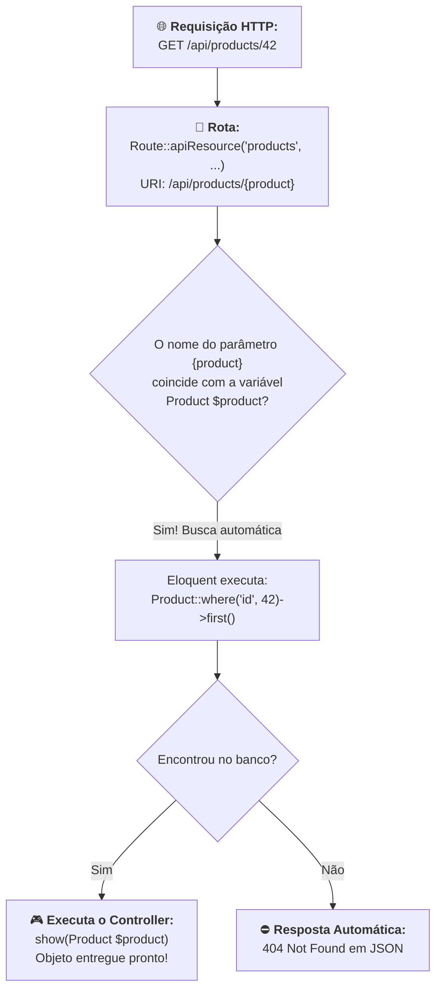

# 03. Route Model Binding e Respostas Semânticas

No **[Capítulo 02: Controllers e Ações CRUD](02-controllers-e-acoes-crud.md)**,
estruturamos nosso primeiro API Controller completo, organizando os endpoints
REST nos métodos `index`, `store`, `show`, `update` e `destroy`, além de
descobrir o atalho `Route::apiResource()`.

Ao implementar os métodos `show`, `update` e `destroy`, no entanto, deparamo-nos
com um padrão repetitivo de código:

```php
public function show(int $id)
{
    $product = Product::findOrFail($id); // 👈 Busca manual
    return response()->json($product);
}

public function update(Request $request, int $id)
{
    $product = Product::findOrFail($id); // 👈 Busca manual de novo
    $product->update(...);
    return response()->json($product);
}

public function destroy(int $id)
{
    $product = Product::findOrFail($id); // 👈 E de novo aqui!
    $product->delete();
    return response()->noContent();
}
```

> _"Se a rota já sabe qual recurso estamos tentando acessar através do parâmetro
> da URL (como `/api/products/42`), por que precisamos receber um número inteiro
> `$id` e consultar o banco manualmente toda vez? Não seria muito mais elegante
> se o Laravel já nos entregasse o objeto `Product` pronto e validado na
> assinatura do método?"_

No ecossistema do Laravel, esse recurso existe e se chama **Route Model
Binding** (Vinculação de Modelo à Rota).

Neste capítulo, você aprenderá como o Route Model Binding funciona nos
bastidores, como utilizá-lo para reduzir drasticamente o código dos seus
Controllers, como customizar chaves de busca para URLs amigáveis com `slug` e
como estruturar respostas JSON semânticas e profissionais para os consumidores
da sua API.

## A Dor: O Boilerplate de Busca e Tratamento Manual de 404

Quando recebemos apenas o identificador numérico (`int $id`), somos obrigados a
repetir a mesma sequência de instruções em todas as ações de detalhe,
atualização e exclusão:

1. Fazer a consulta no banco de dados com `Product::find($id)` ou
   `Product::findOrFail($id)`;
2. Se o registro não existir, interromper a execução e gerar um erro HTTP 404;
3. Se existir, passar a instância para frente.

Veja o contraste entre a abordagem manual tradicional e o Route Model Binding:

```php
<?php
// ❌ CÓDIGO VERBOSO: Busca manual repetitiva com ID bruto
public function show(int $id): JsonResponse
{
    // O desenvolvedor precisa lembrar de usar findOrFail em todo lugar
    $product = Product::findOrFail($id);

    return response()->json($product, 200);
}

// ✅ CÓDIGO IDIOMÁTICO / RECOMENDADO: Route Model Binding automático
public function show(Product $product): JsonResponse
{
    // O Laravel já buscou no banco antes de entrar no método!
    return response()->json($product, 200);
}
```

O método passou de uma lógica de busca e tratamento de erro para **apenas uma
linha de código expressiva e focada na resposta**.

## Como Funciona o Route Model Binding Implícito

O Route Model Binding do Laravel opera por meio de uma convenção simples e
inteligente:



### A Regra da Correspondência de Nomes

Para que a mágica aconteça, basta seguir duas regras básicas:

1. **O segmento dinâmico na rota** deve ter o mesmo nome da entidade no singular
   (ex: `{product}`);
2. **O parâmetro no método do Controller** deve ter a tipagem da classe do Model
   com o mesmo nome de variável (ex: `Product $product`).

Quando você usa `Route::apiResource('products', ProductController::class)`, o
Laravel já gera automaticamente a rota com o parâmetro `{product}`:

```text
GET /api/products/{product}
```

Portanto, basta alterar a assinatura do método no Controller de:

```php
public function show(int $id)
```

Para:

```php
public function show(Product $product)
```

Se o cliente requisitar `/api/products/999` e o produto não existir no banco, o
Laravel **nem chega a executar o corpo do seu método**. Ele intercepta a
requisição imediatamente e devolve um status **`404 Not Found`** padronizado em
JSON!

## Customizando a Chave de Busca: URLs Amigáveis com `slug`

Por padrão, o Route Model Binding sempre utiliza a coluna de chave primária
(`id`) da tabela para localizar o registro.

No entanto, em APIs públicas ou lojas virtuais, muitas vezes queremos expor URLs
mais amigáveis para SEO e para o usuário final, utilizando um `slug` de texto em
vez de um número:

```text
// Em vez de:
GET /api/products/42

// Queremos:
GET /api/products/teclado-mecanico-rgb
```

O Laravel permite alterar a coluna de busca de duas formas muito simples:

### Opção 1: Diretamente na Definição da Rota (Inline)

Você pode especificar a coluna desejada logo após o nome do parâmetro, separada
por dois pontos (`:`):

```php
use App\Http\Controllers\ProductController;
use Illuminate\Support\Facades\Route;

// O Laravel fará a busca automática na coluna "slug" em vez de "id"!
Route::get('/products/{product:slug}', [ProductController::class, 'show']);
```

O Eloquent executará nos bastidores:

```sql
SELECT * FROM products WHERE slug = 'teclado-mecanico-rgb' LIMIT 1;
```

### Opção 2: Globalmente no Model (`getRouteKeyName`)

Se você quiser que o Model `Product` seja **sempre** resolvido pelo `slug` em
qualquer rota do sistema, basta sobrescrever o método `getRouteKeyName()` dentro
da classe do Model:

```php
// app/Models/Product.php

namespace App\Models;

use Illuminate\Database\Eloquent\Model;

class Product extends Model
{
    /**
     * Define a coluna padrão para o Route Model Binding deste modelo.
     */
    public function getRouteKeyName(): string
    {
        return 'slug';
    }
}
```

Agora, qualquer rota `{product}` buscará automaticamente pela coluna `slug`, sem
precisar alterar a declaração das rotas!

## Carregando Relacionamentos com Route Model Binding

E se precisarmos que o produto injetado no método já venha com sua categoria
carregada?

Como o Model já chega instanciado no Controller, podemos utilizar o método
**`load()`** (o equivalente ao `with()` para instâncias já existentes em
memória):

```php
public function show(Product $product): JsonResponse
{
    // Carrega a categoria do produto em memória caso ainda não esteja carregada
    $product->load('category');

    return response()->json($product, 200);
}
```

Dessa forma, mantemos o código limpo, eliminamos o problema do N+1 e devolvemos
o objeto completo com todos os dados associados.

## Padronização de Respostas Semânticas em APIs REST

Uma API de alto nível não se resume apenas a retornar dados; ela deve se
comunicar com os clientes através do protocolo HTTP de forma clara, consistente
e semântica.

O helper global `response()` do Laravel oferece métodos dedicados para cada
cenário:

### 1. Sucesso na Consulta (`200 OK`)

Utilizado em listagens, detalhes e atualizações bem-sucedidas:

```php
return response()->json($product, 200);
```

### 2. Sucesso na Criação (`201 Created`)

Utilizado exclusivamente após criar um novo recurso no banco:

```php
return response()->json($newProduct, 201);
```

### 3. Sucesso sem Conteúdo (`204 No Content`)

Utilizado em operações de remoção (`destroy`), onde o cliente não precisa
receber nenhum dado de volta:

```php
return response()->noContent(); // Retorna status 204 automaticamente
```

### 4. Respostas Customizadas com Headers Adicionais

Se você precisar enviar headers HTTP específicos para o cliente (como headers de
cache, paginação ou metadados de auditoria):

```php
return response()
    ->json($products, 200)
    ->header('X-Total-Count', (string) $total)
    ->header('Cache-Control', 'max-age=60');
```

## O `ProductController` Refatorado e Definitivo

Veja como fica nosso Controller completo após aplicar o Route Model Binding e a
padronização semântica de respostas. Observe como o código se tornou limpo,
enxuto e declarativo:

```php
<?php
// ✅ CÓDIGO DEFINITIVO / ARQUITETURA MODERNA COM ROUTE MODEL BINDING
declare(strict_types=1);

namespace App\Http\Controllers;

use App\Models\Product;
use Illuminate\Http\JsonResponse;
use Illuminate\Http\Request;
use Illuminate\Http\Response;

class ProductController extends Controller
{
    /**
     * 1. GET /api/products
     * Lista produtos paginados com dados da categoria.
     */
    public function index(): JsonResponse
    {
        $products = Product::with('category')->paginate(15);

        return response()->json($products, 200);
    }

    /**
     * 2. POST /api/products
     * Valida e persiste um novo produto.
     */
    public function store(Request $request): JsonResponse
    {
        $validatedData = $request->validate([
            'category_id' => 'required|integer|exists:categories,id',
            'name'        => 'required|string|max:255',
            'description' => 'nullable|string',
            'price'       => 'required|numeric|min:0.01',
            'stock'       => 'nullable|integer|min:0',
            'is_active'   => 'nullable|boolean',
        ]);

        $product = Product::create($validatedData);

        return response()->json($product, 201);
    }

    /**
     * 3. GET /api/products/{product}
     * O produto é injetado diretamente pelo Route Model Binding.
     */
    public function show(Product $product): JsonResponse
    {
        $product->load('category');

        return response()->json($product, 200);
    }

    /**
     * 4. PUT/PATCH /api/products/{product}
     * Atualiza o produto injetado.
     */
    public function update(Request $request, Product $product): JsonResponse
    {
        $validatedData = $request->validate([
            'category_id' => 'sometimes|integer|exists:categories,id',
            'name'        => 'sometimes|string|max:255',
            'description' => 'nullable|string',
            'price'       => 'sometimes|numeric|min:0.01',
            'stock'       => 'sometimes|integer|min:0',
            'is_active'   => 'sometimes|boolean',
        ]);

        $product->update($validatedData);

        return response()->json($product, 200);
    }

    /**
     * 5. DELETE /api/products/{product}
     * Remove o produto injetado e responde com 204.
     */
    public function destroy(Product $product): Response
    {
        $product->delete();

        return response()->noContent();
    }
}
```

<details>
<summary>🔍 Aprofundamento Técnico: Scoped Route Model Binding em Rotas Aninhadas</summary>

Em sistemas com forte relacionamento hierárquico, é muito comum termos rotas
aninhadas. Por exemplo, acessar um produto específico que deve
**obrigatoriamente pertencer** a uma categoria determinada:

```php
Route::get('/categories/{category}/products/{product}', [ProductController::class, 'showByCategory']);
```

O perigo aqui é uma vulnerabilidade lógica chamada **Acesso Cruzado Não
Autorizado**: e se o cliente enviar o ID de uma categoria existente (`1`), mas o
ID de um produto que pertence a **outra** categoria (`2`)?

O Laravel resolve isso de forma elegante com o **Scoped Route Model Binding**:

```php
// O Laravel garante que o {product} realmente pertence à {category}!
Route::get('/categories/{category}/products/{product}', function (Category $category, Product $product) {
    return response()->json($product);
})->scopeBindings();
```

Com `scopeBindings()`, o Laravel inspeciona o relacionamento entre `Category` e
`Product` e adiciona automaticamente uma cláusula de segurança no SQL:

```sql
SELECT * FROM products WHERE id = ? AND category_id = ?;
```

Se o produto não pertencer àquela categoria específica, o Laravel retorna **404
Not Found** instantaneamente, garantindo a integridade dos dados sem que você
precise escrever nenhuma linha de validação manual!

</details>

---

<a href="02-controllers-e-acoes-crud.md">← Controllers e Ações CRUD</a>

<p align="right"><a href="../../../typescript/react/01-o-que-e-react-e-o-paradigma-declarativo.md">Próximo: Trilha React & Frontend →</a></p>
