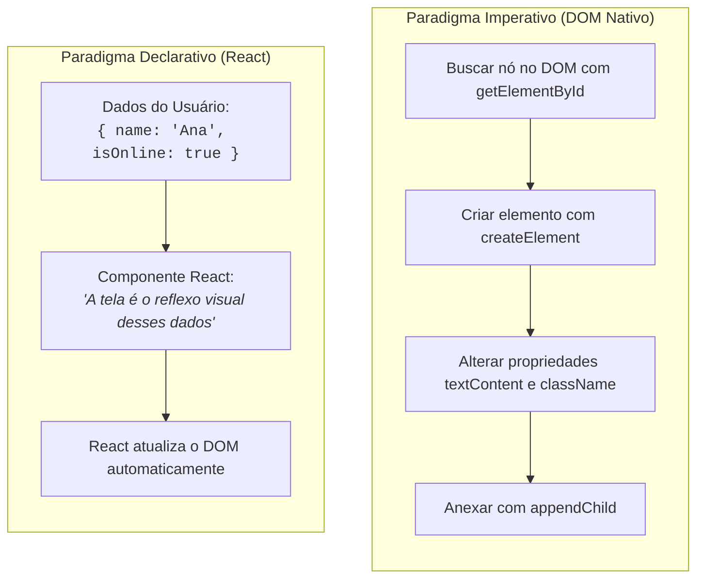

# 01. O Que É o React e o Paradigma Declarativo

Nos módulos anteriores, construímos uma base sólida para a Web moderna:
aprendemos a tipar e estruturar regras de negócio com **TypeScript**, exploramos
como a rede e o protocolo **HTTP** funcionam e manipulamos a árvore do **DOM**
diretamente no navegador.

No entanto, conforme as aplicações web evoluem de páginas simples para sistemas
dinâmicos e interativos (como redes sociais, painéis de controle, editores e
lojas virtuais), surge uma pergunta inevitável:

> _"Como construir e manter interfaces ricas em que dezenas de elementos mudam
> de estado a todo momento sem transformar o código em um emaranhado de nós e
> seletores manuais?"_

Neste capítulo, você compreenderá por que o desenvolvimento frontend clássico se
tornou insustentável em escala, entenderá as limitações práticas dos Web
Components nativos, descobrirá o que é o **React** e dará seus primeiros passos
criando um projeto moderno com **Vite e TypeScript**.

## A Dor: A Manipulação Imperativa do DOM

No submódulo de **Manipulação do DOM**, aprendemos a criar e alterar elementos
na tela usando os métodos nativos do navegador:

```typescript
// ❌ ABORDAGEM IMPERATIVA: Você precisa comandar cada passo manual
function renderUserProfile(name: string, isOnline: boolean) {
  // 1. Busca o container na árvore
  const container = document.getElementById("user-card");
  if (!container) return;

  // 2. Limpa o conteúdo anterior
  container.innerHTML = "";

  // 3. Cria o elemento do título manualmente
  const title = document.createElement("h2");
  title.textContent = name;

  // 4. Cria a etiqueta de status
  const badge = document.createElement("span");
  badge.textContent = isOnline ? "Online" : "Offline";
  badge.className = isOnline ? "badge-green" : "badge-gray";

  // 5. Encaixa manualmente na árvore
  container.appendChild(title);
  container.appendChild(badge);
}
```

Essa abordagem é chamada de **Programação Imperativa** — nela, você precisa
detalhar explicitamente **o passo a passo de COMO** o navegador deve selecionar,
limpar, criar, estilizar e anexar cada nó do DOM.

Em aplicações reais com dezenas de botões, abas, listas e formulários, o modelo
imperativo gera três grandes dores:

1. **Código Frágil e Verboso:** Para criar estruturas simples de tela, gastamos
   dezenas de linhas de `document.createElement` e `appendChild`;
2. **Sincronização Manual de Estado:** Se o status do usuário mudar de `Online`
   para `Offline`, precisamos lembrar exatamente quais elementos do DOM devem
   ser buscados e alterados. Se esquecermos uma linha, a tela exibirá dados
   desatualizados ou inconsistentes;
3. **Alto Risco de Efeitos Colaterais:** Qualquer função pode alterar qualquer
   nó da tela a qualquer momento, tornando o rastreamento de bugs extremamente
   difícil.

## A Tentativa Nativa: E os Web Components?

Como vimos anteriormente, o próprio comitê da Web desenvolveu o padrão de **Web
Components** (Custom Elements, Shadow DOM e Templates) para permitir a criação
de componentes reutilizáveis nativamente no navegador:

```typescript
// ⚠️ WEB COMPONENTS: Excelente isolamento nativo, mas com muito boilerplate manual
class UserCard extends HTMLElement {
  static get observedAttributes() {
    return ["name", "status"];
  }

  attributeChangedCallback(name: string, oldValue: string, newValue: string) {
    // É necessário gerenciar manualmente a atualização dos nós internos
    this.render();
  }

  private render() {
    const userName = this.getAttribute("name") || "";
    const isOnline = this.getAttribute("status") === "online";

    this.innerHTML = `
      <h2>${userName}</h2>
      <span class="${isOnline ? "badge-green" : "badge-gray"}">
        ${isOnline ? "Online" : "Offline"}
      </span>
    `;
  }
}

customElements.define("user-card", UserCard);
```

Embora os Web Components resolvam o problema do encapsulamento nativo, eles
trazem desafios significativos para o dia a dia do desenvolvimento de interfaces
complexas:

- **Muito Código de Infraestrutura (_Boilerplate_):** Exigem classes com métodos
  de ciclo de vida extensos e registro global manual;
- **Reatividade Manual:** Atualizar a tela quando dados mudam exige converter
  valores em strings para atributos observados ou manipular nós manualmente;
- **Falta de Tipagem Estrita Integrada:** O HTML do navegador não oferece
  checagem estática de tipos nativa para tags personalizadas, dificultando o uso
  fluido do TypeScript.

A indústria sentiu a necessidade de uma ferramenta que tornasse a criação de
interfaces tão simples quanto escrever funções puras e legíveis. É aqui que
entra o **React**.

## O Conceito: O Que é o React?

Criado em 2013 por engenheiros do Facebook (Meta) e mantido hoje como um projeto
de código aberto universal, o **React** é uma biblioteca JavaScript para a
**construção declarativa de interfaces de usuário baseadas em componentes**.



### Imperativo vs. Declarativo: A Analogia do Restaurante

Para entender a diferença de mentalidade entre os dois modelos, pense em como
você pede uma refeição:

- **Abordagem Imperativa (Você na Cozinha):** Você entra na cozinha do
  restaurante e dá ordens passo a passo ao cozinheiro: _"Acenda o fogão, coloque
  a frigideira, jogue um fio de azeite, quebre dois ovos, mexa por 2 minutos e
  sirva no prato raso"_.
- **Abordagem Declarativa (Você no Cardápio):** Você apenas senta à mesa e
  declara o que deseja: _"Por favor, quero uma omelete de queijo"_. Como o
  cozinheiro vai acender o fogo e mexer os ovos é responsabilidade interna da
  cozinha.

No React, você **não diz ao navegador COMO alterar cada nó do DOM**. Você
simplesmente **declara COMO a interface deve ser** com base nos dados atuais, e
o React se encarrega de sincronizar o navegador de forma otimizada.

## A Solução: O Que é JSX / TSX?

Para permitir que você declare interfaces visuais de forma natural dentro do
código TypeScript, o React introduziu o **JSX** (_JavaScript XML_) e o **TSX**
(_TypeScript XML_).

O JSX permite escrever estruturas muito parecidas com HTML diretamente dentro de
funções TypeScript:

```tsx
// ✅ ABORDAGEM DECLARATIVA COM REACT
type UserCardProps = {
  name: string;
  isOnline: boolean;
};

function UserCard({ name, isOnline }: UserCardProps) {
  return (
    <div className="user-card">
      <h2>{name}</h2>
      <span className={isOnline ? "badge-green" : "badge-gray"}>
        {isOnline ? "Online" : "Offline"}
      </span>
    </div>
  );
}
```

Observe a clareza e elegância dessa função:

- Não há nenhuma chamada manual a `document.createElement` ou `appendChild`;
- A marcação visual e a lógica do componente vivem juntas de forma limpa;
- O TypeScript oferece checagem estática completa sobre as propriedades (`name`
  e `isOnline`).

> **Importante:** O JSX não é HTML puro e não é entendido diretamente pelo
> navegador. Durante o processo de build gerenciado pelo **Vite**, o compilador
> transpila a sintaxe JSX em chamadas normais de funções JavaScript.

## Setup Prático: Criando seu Projeto com Vite

Para praticar React com TypeScript com a melhor experiência de desenvolvimento
do mercado, utilizaremos o **Vite**, o empacotador ultrarrápido que conhecemos
no [Módulo 00](../../00-ferramental/04-o-pipeline-moderno-da-web.md).

### 1. Criando o Projeto

Abra o seu terminal na pasta onde deseja guardar seus estudos e execute o
comando:

```bash
npm create vite@latest meu-primeiro-app -- --template react-ts
```

Esse comando cria uma pasta chamada `meu-primeiro-app` configurada
automaticamente com:

- React 18+ ou 19;
- TypeScript configurado (`tsconfig.json`);
- Suporte nativo a arquivos `.tsx`;
- Servidor de desenvolvimento com recarregamento instantâneo (_Hot Module
  Replacement - HMR_).

### 2. Instalando as Dependências e Executando

Entre na pasta do projeto e instale as dependências:

```bash
cd meu-primeiro-app
npm install
```

Inicie o servidor de desenvolvimento local:

```bash
npm run dev
```

O terminal exibirá um endereço local (geralmente `http://localhost:5173/`). Ao
abrir esse link no navegador, você verá a página inicial do React em execução!

## Tabela Comparativa: As 3 Abordagens

| Aspecto                       | DOM Nativo (Imperativo)            | Web Components                     | React (Declarativo)                |
| :---------------------------- | :--------------------------------- | :--------------------------------- | :--------------------------------- |
| **Paradigma**                 | Imperativo (manipulação manual)    | Orientado a Objetos (Classes/Tags) | Declarativo (Funções e Composição) |
| **Criação de Telas**          | `createElement` / `innerHTML`      | Templates HTML e Shadow Root       | Sintaxe JSX/TSX expressiva         |
| **Sincronização de Dados**    | Manual em cada ponto do código     | Observadores manuais de atributos  | Automática em função dos dados     |
| **Tipagem com TypeScript**    | Manual com asserções de nós do DOM | Limitada para atributos custom     | Tipagem estrita completa e nativa  |
| **Instalação / Dependências** | Nenhuma (Nativo do navegador)      | Nenhuma (Nativo do navegador)      | Exige biblioteca (`npm i react`)   |

<details>
<summary>🔍 O React é uma biblioteca ou um framework?</summary>

Na comunidade de desenvolvimento, é muito comum ouvir discussões sobre o React
ser uma **biblioteca** (_library_) ou um **framework**:

- **Framework (como Angular ou Next.js):** Oferece uma estrutura completa e
  opinativa de fábrica com todas as regras prontas (roteamento, requisições
  HTTP, formulários, internacionalização e arquitetura de pastas rígida);
- **Biblioteca (como o React):** Tem foco cirúrgico em resolver **um único
  problema com excelência**: a renderização e composição da camada visual da
  interface (a camada de _View_).

Essa flexibilidade permite que você combine o React livremente com as
ferramentas que estudamos ao longo do curso (como o **Axios** para requisições e
o **Zod** para validação de dados).

</details>

## O Que Vem a Seguir?

Neste capítulo inicial, compreendemos a motivação do paradigma declarativo do
React, a transição do DOM imperativo para componentes e realizamos o setup de um
projeto com Vite e TypeScript.

No próximo capítulo, vamos abrir o projeto criado, entender a anatomia de
arquivos como `index.html` e `main.tsx`, descobrir **o que é o ponto de entrada
da aplicação** e aprender as **regras essenciais de escrita de Componentes e
JSX**!

---

<p align="right"><a href="02-o-ponto-de-entrada-e-componentes.md">Próximo: O Ponto de Entrada e a Árvore de Componentes →</a></p>
