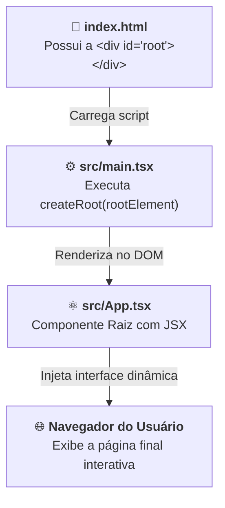
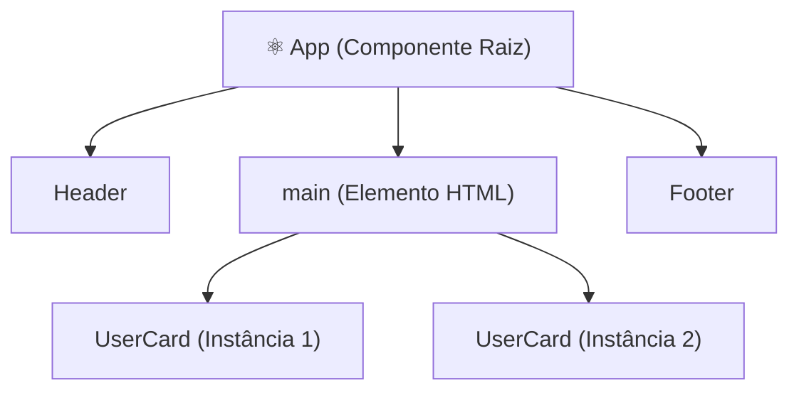

# 02. O Ponto de Entrada e a Árvore de Componentes

No capítulo anterior, compreendemos o paradigma declarativo do React e geramos a
nossa primeira aplicação utilizando o Vite.

Ao abrir a pasta do projeto recém-criado no VS Code, você se depara com uma
série de pastas e arquivos: `index.html`, `package.json`, `src/main.tsx`,
`src/App.tsx`, entre outros. Para quem está começando, essa estrutura pode
parecer intimidadora.

> _"Como o navegador — que só entende HTML, CSS e JavaScript nativos — consegue
> pegar uma função TypeScript que retorna JSX (`App.tsx`) e desenhá-la na
> tela?"_

Neste capítulo, você desmistificará o **ponto de entrada** da aplicação,
compreenderá como o React assume o controle da página através do `createRoot`,
aprenderá o que é um **Componente** e dominará as **três regras de ouro da
sintaxe JSX**.

## A Estrutura de Arquivos de um Projeto Vite

Ao abrir um projeto React com TypeScript gerado pelo Vite, a estrutura básica é
organizada da seguinte forma:

```text
meu-primeiro-app/
├── index.html           <-- 1. O arquivo HTML hospedeiro único
├── package.json         <-- 2. Dependências e scripts do projeto
├── tsconfig.json        <-- 3. Configurações do compilador TypeScript
├── vite.config.ts       <-- 4. Configurações do empacotador Vite
└── src/                 <-- 5. Onde mora todo o nosso código-fonte
    ├── main.tsx         <-- 6. O ponto de entrada (o maestro)
    ├── App.tsx          <-- 7. Nosso primeiro componente React
    ├── App.css          <-- 8. Estilos do componente App
    └── index.css        <-- 9. Estilos globais da aplicação
```

Para entender como a mágica acontece, precisamos seguir o caminho que o
navegador percorre desde a primeira linha até a exibição visual na tela.

## O Ponto de Entrada: Do `index.html` ao `createRoot`

Diferente de sites clássicos onde cada página tinha seu próprio arquivo HTML
(`sobre.html`, `contato.html`), o React opera como uma **SPA (_Single Page
Application_)**. Isso significa que existe **apenas um arquivo HTML** servindo
de casca para toda a aplicação.

### 1. O Hospedeiro: `index.html`

Se você inspecionar o arquivo `index.html` na raiz do projeto, verá um HTML
surpreendentemente enxuto:

```html
<!doctype html>
<html lang="pt-BR">
  <head>
    <meta charset="UTF-8" />
    <meta name="viewport" content="width=device-width, initial-scale=1.0" />
    <title>Meu Primeiro App React</title>
  </head>
  <body>
    <!-- O container onde TODO o React será injetado -->
    <div id="root"></div>

    <!-- O gatilho que carrega o TypeScript do React -->
    <script type="module" src="/src/main.tsx"></script>
  </body>
</html>
```

Observe dois pontos vitais:

1. **`<div id="root"></div>`:** É um container completamente vazio. Ele atua
   como uma "tela em branco" ou o ponto de ancoragem onde o React montará toda a
   interface;
2. **`<script type="module" src="/src/main.tsx"></script>`:** Avisa ao navegador
   para carregar o arquivo mestre `main.tsx`.

### 2. O Maestro: `src/main.tsx`

O arquivo `src/main.tsx` é o verdadeiro ponto de partida do código
JavaScript/TypeScript. Ele conecta o mundo do DOM nativo ao ecossistema do
React:

```tsx
import React from "react";
import ReactDOM from "react-dom/client";
import App from "./App.tsx";
import "./index.css";

// 1. Busca a div vazia na página
const rootElement = document.getElementById("root");

// 2. Cria a raiz do React conectada a essa div e desenha o componente App
ReactDOM.createRoot(rootElement!).render(
  <React.StrictMode>
    <App />
  </React.StrictMode>,
);
```

Vamos dissecar o que essa instrução faz:

- **`document.getElementById("root")`:** Localiza a tag `<div id="root">` no
  HTML;
- **`ReactDOM.createRoot(...)`:** Cria a raiz de controle do React sobre aquele
  elemento do DOM;
- **`.render(<App />)`:** Diz ao React: _"Pegue o componente `<App />`, converta
  seu JSX em elementos reais do navegador e desenhe tudo dentro do `#root`"_.



<details>
<summary>🔍 O que é o &lt;React.StrictMode&gt; no main.tsx?</summary>

No arquivo `main.tsx`, você notou que o `<App />` está envolvido por uma tag
chamada `<React.StrictMode>`.

O **Strict Mode** (Modo Estrito) é uma ferramenta exclusiva para o ambiente de
**desenvolvimento**. Ele não adiciona nada visual à página, mas executa
checagens adicionais no seu código para ajudá-lo a encontrar bugs e más práticas
cedo.

Uma curiosidade muito comum é que o Strict Mode faz com que o React renderize
seus componentes **duas vezes seguidas** em ambiente local. Isso é intencional:
serve para garantir que as suas funções de componente não possuem efeitos
colaterais ocultos. Em produção, essa checagem dupla é automaticamente
desativada.

</details>

## O Que É um Componente React?

Em React, a interface do usuário é construída através de **Componentes**.

> **Definição:** Um **Componente** nada mais é do que uma **função
> TypeScript/JavaScript que retorna JSX** (a descrição visual do que deve
> aparecer na tela).

Veja um exemplo de componente que poderia estar declarado em `src/App.tsx`:

```tsx
// ✅ Um componente React simples e funcional
function App() {
  return (
    <div className="container">
      <h1>Bem-vindo ao Curso Web da FATEC!</h1>
      <p>Este é o nosso primeiro componente React com TypeScript.</p>
    </div>
  );
}

export default App;
```

### A Regra Fundamental da Nomenclatura (PascalCase)

No React, todo nome de componente **DEVE obrigatoriamente começar com letra
maiúscula** (convenção conhecida como **PascalCase**):

```tsx
// ❌ ERRADO: O React entenderá 'userCard' como uma tag HTML inexistente
function userCard() {
  return <div>Cartão do Usuário</div>;
}

// ✅ CORRETO: Começa com letra maiúscula
function UserCard() {
  return <div>Cartão do Usuário</div>;
}
```

> **Por que isso é obrigatório?**
>
> Quando o compilador do React encontra uma tag começando com letra minúscula
> (como `<div>`, `<span>`, `<h1>`), ele assume que é um elemento padrão do HTML.
> Quando encontra uma tag com inicial maiúscula (como `<UserCard />` ou `<App/>`),
> ele sabe que deve executar a **sua função de componente**.

## As Três Regras de Ouro do JSX

O JSX é muito amigável porque lembra o HTML que já conhecemos, mas possui regras
sintáticas mais rigorosas que precisamos respeitar:

### 1. Retorno de um Único Elemento Raiz (Fragments)

Uma função em TypeScript/JavaScript só pode retornar **um único valor por vez**.
Por isso, um componente React não pode retornar múltiplos elementos "irmãos"
soltos sem um elemento pai que os envolva:

```tsx
// ❌ ERRO DE COMPILAÇÃO: Dois elementos raiz soltos
function UserProfile() {
  return (
    <h1>Nome do Usuário</h1>
    <p>Biografia do usuário...</p>
  );
}
```

Para corrigir, poderíamos envolver tudo em uma `<div>`:

```tsx
// ✅ VÁLIDO: Envolvido por uma <div> pai
function UserProfile() {
  return (
    <div>
      <h1>Nome do Usuário</h1>
      <p>Biografia do usuário...</p>
    </div>
  );
}
```

No entanto, criar `<div>` apenas para satisfazer essa regra polui o HTML final
com tags desnecessárias. Para resolver isso de forma elegante, o React oferece
os **Fragments** (`<>...</>`):

```tsx
// ✅ MELHOR PRÁTICA: Usando Fragment (<> e </>)
function UserProfile() {
  return (
    <>
      <h1>Nome do Usuário</h1>
      <p>Biografia do usuário...</p>
    </>
  );
}
```

O Fragment funciona como um nó "invisível": ele agrupa os elementos para o React
sem adicionar nenhum nó extra à árvore do DOM final!

### 2. Fechamento Obrigatório de Todas as Tags

No HTML clássico, tags que não possuem conteúdo interno (como ``,
`<input>`, `<br>`, `<hr>`) costumam ser deixadas abertas. No JSX,
**absolutamente todas as tags devem ser explicitamente fechadas**:

```tsx
// ❌ ERRO DE COMPILAÇÃO NO JSX
return (
  <div>
    
    <input type="text">
    <br>
  </div>
);

// ✅ CORRETO: Tags auto-fechadas com '/>'
return (
  <div>
    
    <input type="text" />
    <br />
  </div>
);
```

### 3. Atributos em camelCase (`className` e `htmlFor`)

Como o JSX é transformado em código JavaScript por baixo dos panos, palavras que
são reservadas na linguagem não podem ser usadas como atributos de tags:

- No lugar de `class`, usamos **`className`** (porque `class` é a palavra-chave
  de classes no JS/TS);
- No lugar de `for` (em `<label for="...">`), usamos **`htmlFor`** (porque `for`
  é o laço de repetição).

```tsx
// ❌ EVITE: 'class' pode causar avisos no console
<div class="card-box">...</div>

// ✅ RECOMENDADO: 'className' em JSX
<div className="card-box">
  <label htmlFor="user-email">E-mail:</label>
  <input id="user-email" type="email" />
</div>
```

## A Árvore de Componentes: Composição na Prática

O verdadeiro poder do React está na **Composição**: a capacidade de construir
componentes pequenos, focados e reutilizáveis e depois combiná-los como blocos
de Lego para formar uma página completa.

Vamos ver um exemplo prático. Imagine que queremos criar uma tela com um
cabeçalho, uma lista de cartões e um rodapé.

Podemos criar componentes dedicados:

```tsx
// 1. Componente de Cabeçalho
function Header() {
  return (
    <header className="main-header">
      <h2>Portal FATEC</h2>
    </header>
  );
}

// 2. Componente de Cartão de Usuário
function UserCard() {
  return (
    <div className="user-card">
      <h3>Aluno FATEC</h3>
      <p>Curso: Desenvolvimento Web</p>
    </div>
  );
}

// 3. Componente de Rodapé
function Footer() {
  return (
    <footer className="main-footer">
      <p>© 2026 FATEC - Todos os direitos reservados.</p>
    </footer>
  );
}
```

E no nosso componente principal `App.tsx`, nós simplesmente **compomos** a tela:

```tsx
// 4. Componente Principal combinando os blocos
function App() {
  return (
    <div className="app-container">
      <Header />

      <main className="content">
        <UserCard />
        <UserCard />
      </main>

      <Footer />
    </div>
  );
}

export default App;
```

O React constrói uma **Árvore de Componentes** hierárquica e limpa:



## Tabela Comparativa: HTML Tradicional vs. JSX no React

| Aspecto                       | HTML Tradicional (`.html`)      | JSX / TSX no React (`.tsx`)             |
| :---------------------------- | :------------------------------ | :-------------------------------------- |
| **Definição de Classes**      | `class="nome-da-classe"`        | `className="nome-da-classe"`            |
| **Vínculo de Labels**         | `<label for="id">`              | `<label htmlFor="id">`                  |
| **Tags Vazias (`img`, `br`)** | Fechamento opcional (``)   | Fechamento obrigatório (``)      |
| **Múltiplos Elementos**       | Podem ficar soltos no documento | Exigem elemento pai único ou `<>...</>` |
| **Onde é Escrito?**           | Arquivos estáticos de marcação  | Dentro do retorno de funções TypeScript |
| **Checagem de Erros**         | Silenciosa (o browser tolera)   | Estrita (o compilador avisa no editor)  |

## O Que Vem a Seguir?

Neste capítulo, desvendamos como o Vite inicializa a aplicação com `createRoot`,
aprendemos a criar nossos primeiros componentes e dominamos as regras da sintaxe
JSX.

No entanto, até agora nossos componentes estão exibindo apenas textos fixos e
estáticos.

No próximo capítulo, aprenderemos a tornar o JSX verdadeiramente vivo:
descobriremos como abrir a **janela para o JavaScript com `{}`**, renderizar
variáveis, expressões matemáticas e manipular **atributos dinâmicos (`src`,
`alt`, `href`, `disabled`, `className` e estilos inline `style={{}}`)**!

---

<a href="01-o-que-e-react-e-o-paradigma-declarativo.md">← O Que É o React e o
Paradigma Declarativo</a>

<p align="right"><a href="03-conteudo-e-atributos-dinamicos-no-jsx.md">Próximo: Conteúdo e Atributos Dinâmicos no JSX →</a></p>
