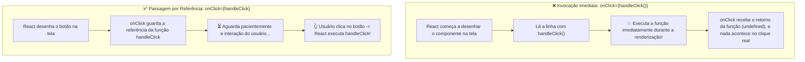

# 04. Eventos no React: Escutando Interações do Usuário

Nos capítulos anteriores, aprendemos a anatomia de um componente e descobrimos
como renderizar dados dinâmicos utilizando expressões e atributos com as chaves
`{}` no JSX.

No entanto, uma aplicação web moderna não é apenas um painel estático de
leitura. Ela é viva e interativa: os usuários clicam em botões, digitam em
campos de texto, passam o mouse sobre elementos e enviam formulários.

> _"Como escutamos e reagimos às ações do usuário no React de forma declarativa
> e sem a bagunça do `addEventListener` manual?"_

Neste capítulo, você aprenderá a manipular **Eventos no JSX (`onClick`,
`onChange`, `onSubmit`)**, dominará a diferença vital entre **passar uma função
por referência vs invocá-la imediatamente** e entenderá o que é o
**`SyntheticEvent`**.

## A Dor: O Registro Manual de Eventos no DOM Nativo

No JavaScript tradicional sem frameworks, para fazer um botão reagir a um
clique, precisávamos seguir um fluxo manual e desconectado:

```typescript
// ❌ DOM NATIVO IMPERATIVO: Código disperso e sujeito a falhas
const buttonElement = document.querySelector("#submit-btn");

if (buttonElement) {
  buttonElement.addEventListener("click", (event) => {
    console.log("Botão clicado manualmente!");
  });
}
```

Esse modelo apresenta problemas sérios em aplicações dinâmicas:

1. **Risco de Elemento Nulo:** Se o script rodar antes de o botão ser criado na
   página, `querySelector` retorna `null` e o código quebra;
2. **Vazamento de Memória (_Memory Leaks_):** Se o elemento for removido da
   tela, é necessário lembrar de remover o listener com `removeEventListener`;
3. **Desconexão Visual:** O código que cria a interface fica em um lugar (HTML)
   e a lógica que escuta os eventos fica em outro arquivo (JS), tornando a
   leitura fragmentada.

## A Solução: Eventos Declarativos no JSX

No React, os eventos são declarados **diretamente nas próprias tags JSX**, de
forma clara e próxima do elemento visual com o qual o usuário interage.

### 1. Sintaxe em camelCase

Ao contrário do HTML puro (que usa atributos em minúsculas como `onclick` ou
`onchange`), o React padroniza todos os nomes de eventos em **camelCase**:

- `onclick` $\rightarrow$ **`onClick`**
- `onchange` $\rightarrow$ **`onChange`**
- `onsubmit` $\rightarrow$ **`onSubmit`**
- `onmouseenter` $\rightarrow$ **`onMouseEnter`**
- `onkeydown` $\rightarrow$ **`onKeyDown`**

### 2. Criando sua Primeira Função Manipuladora (_Event Handler_)

Por convenção limpa e idiomática, declaramos funções tratadoras (conhecidas na
indústria como **Event Handlers**) dentro do próprio componente, usando o
prefixo `handle` seguido pelo nome da ação (ex: `handleClick`, `handleSubmit`,
`handleInputChange`):

```tsx
// ✅ Tratamento de evento simples e limpo no React
function ActionButton() {
  // 1. Declaramos a função que trata o evento
  function handleClick() {
    alert("Você clicou no botão com sucesso!");
  }

  // 2. Passamos a função para o atributo onClick
  return (
    <button onClick={handleClick} className="btn-primary">
      Clique em Mim
    </button>
  );
}

export default ActionButton;
```

Quando o usuário clica no botão, o React executa a função `handleClick`
automaticamente!

## A Grande Armadilha: Passar por Referência vs. Invocar Imediatamente

Esta é, sem dúvida, a armadilha que mais confunde quem está dando os primeiros
passos no React.

Observe atentamente os dois códigos abaixo:

```tsx
// ❌ CÓDIGO COM BUG: Chamando a função com parênteses ()
<button onClick={handleClick()}>Clique Aqui</button>

// ✅ CÓDIGO CORRETO: Passando apenas a REFERÊNCIA da função
<button onClick={handleClick}>Clique Aqui</button>
```

### O Que Acontece no Código com Bug (`handleClick()`)?

Ao colocar parênteses `()`, você está **invocando a função imediatamente** no
exato instante em que o componente está sendo renderizado na tela, antes mesmo
de qualquer pessoa encostar no mouse!



> **Regra de Ouro:**
>
> Para eventos, **nunca execute a função com parênteses diretamente no JSX**.
> Entregue apenas o nome da função (a referência) para que o React a chame no
> momento certo.

## Passando Argumentos Personalizados para o Handler

E se você precisar disparar uma função que recebe parâmetros específicos (como o
ID de um usuário ou o nome de um produto)?

Se você tentar escrever `onClick={handleDelete(user.id)}`, cairá na armadilha da
invocação imediata.

A forma correta e idiomática de passar parâmetros é envolver a chamada em uma
**Arrow Function anônima**:

```tsx
type UserItemProps = {
  id: number;
  name: string;
};

function UserItem({ id, name }: UserItemProps) {
  function handleDeleteUser(userId: number) {
    console.log(`Excluindo o usuário com ID: ${userId}`);
  }

  return (
    <div className="user-row">
      <span>{name}</span>

      {/* ✅ Arrow function: só executará handleDeleteUser quando o clique ocorrer */}
      <button onClick={() => handleDeleteUser(id)} className="btn-danger">
        Excluir
      </button>
    </div>
  );
}
```

## O Objeto de Evento do React (`SyntheticEvent`)

Sempre que um evento é disparado, o React entrega automaticamente para a sua
função um objeto contendo todas as informações sobre a interação (qual tecla foi
pressionada, coordenadas do mouse, elemento clicado, etc.).

No React, esse objeto é chamado de **`SyntheticEvent`** (Evento Sintético). Ele
é um invólucro padronizado pelo React para garantir que os eventos se comportem
de maneira idêntica em qualquer navegador.

### 1. Capturando o Texto Digitado em um Input (`onChange`)

Quando o usuário digita em um campo `<input>`, usamos o evento `onChange` e
acessamos `event.target.value`:

```tsx
function SearchBar() {
  function handleInputChange(event: React.ChangeEvent<HTMLInputElement>) {
    const textTyped = event.target.value;
    console.log("Texto digitado:", textTyped);
  }

  return (
    <div className="search-box">
      <label htmlFor="search-input">Buscar Curso:</label>
      <input
        id="search-input"
        type="text"
        placeholder="Digite para pesquisar..."
        onChange={handleInputChange}
      />
    </div>
  );
}
```

### 2. Prevenindo o Recarregamento de Formulários (`onSubmit`)

No HTML tradicional, quando um formulário é enviado (`<form>`), o navegador
tenta recarregar a página inteira. No React (como criamos Single Page
Applications), usamos **`event.preventDefault()`** para cancelar esse
comportamento padrão:

```tsx
function LoginForm() {
  function handleSubmit(event: React.FormEvent<HTMLFormElement>) {
    // 🛡️ Impede que o navegador recarregue a página
    event.preventDefault();

    console.log("Formulário validado e pronto para envio via Axios!");
  }

  return (
    <form onSubmit={handleSubmit} className="login-form">
      <h3>Acesso ao Portal</h3>
      <input type="email" placeholder="Seu e-mail" />
      <input type="password" placeholder="Sua senha" />
      <button type="submit">Entrar</button>
    </form>
  );
}
```

## Tabela Sintética: Os Eventos Mais Utilizados no React

| Evento JSX      | Disparado Quando...                          | Exemplo Típico de Uso                           |
| :-------------- | :------------------------------------------- | :---------------------------------------------- |
| **`onClick`**   | O usuário clica em um elemento               | Botões, links, ícones, cards clicáveis          |
| **`onChange`**  | O valor de um campo de formulário muda       | Inputs de texto, checkboxes, selects            |
| **`onSubmit`**  | Um formulário é submetido                    | Tags `<form>` para envio de dados com validação |
| **`onKeyDown`** | Uma tecla do teclado é pressionada           | Atalhos de teclado, busca ao apertar `Enter`    |
| **`onFocus`**   | O elemento recebe o foco de digitação        | Destacar borda do campo ou exibir dicas         |
| **`onBlur`**    | O elemento perde o foco (usuário clica fora) | Validação imediata de campo preenchido          |

<details>
<summary>🔍 Como o React lida com eventos por baixo dos panos? (Event Delegation)</summary>

Se você tiver uma lista com 1.000 botões na tela, registrar um listener
individual para cada botão no navegador consumiria muita memória RAM.

O React resolve isso de forma brilhante com **Delegação de Eventos (_Event
Delegation_)**:

Em vez de anexar listeners em cada nó individual do DOM, o React registra apenas
um único ouvinte global na raiz da sua aplicação (`<div id="root">`). Quando
qualquer elemento é clicado, o evento sobe na árvore (_Event Bubbling_) até a
raiz, e o React direciona a execução para o componente correto com altíssima
performance.

</details>

## O Que Vem a Seguir?

Neste capítulo, aprendemos a escutar e tratar interações do usuário no React de
forma declarativa, evitando a armadilha da invocação imediata e manipulando
eventos com segurança.

Agora que nossos botões e formulários já sabem reagir a cliques e digitações,
chegou o momento de dar o próximo grande salto: **fazer a interface visual mudar
e se atualizar dinamicamente** quando o usuário interage!

No próximo capítulo, entraremos no conceito mais fundamental do React:
**Estado e Reatividade com o Hook `useState`**!

---

<a href="03-conteudo-e-atributos-dinamicos-no-jsx.md">← Conteúdo e Atributos Dinâmicos no JSX</a>

<p align="right"><a href="05-estado-e-reatividade-com-usestate.md">Próximo: Estado e Reatividade com useState →</a></p>
