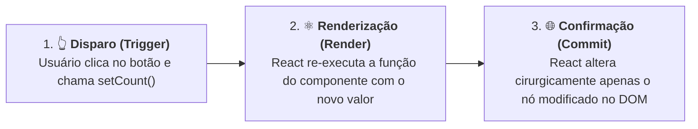

# 05. Estado e Reatividade com useState

No capítulo anterior, aprendemos a escutar e responder a eventos do usuário no
React utilizando atributos em camelCase como `onClick`, `onChange` e `onSubmit`.

No entanto, ao tentar fazer um botão interagir com variáveis locais comuns do
TypeScript para alterar um número ou texto na tela, nos deparamos com um
comportamento frustrante: o valor no console do navegador muda, mas a interface
visual continua completamente imóvel e congelada.

> _"Se variáveis locais normais não conseguem atualizar o que o usuário vê, como
> dizemos ao React para guardar informações na memória e redesenhar a tela
> automaticamente sempre que esses dados mudarem?"_

Neste capítulo, você compreenderá a limitação das variáveis comuns, descobrirá o
conceito fundamental de **Estado (_State_)**, aprenderá a utilizar o **Hook
`useState`**, dominará a regra de ouro da **Imutabilidade** e conectará o
mecanismo de reatividade às **Closures** que estudamos no Módulo 01.

## A Dor: Por Que Variáveis Comuns (`let`) Não Funcionam na Tela?

Para entender por que precisamos de uma ferramenta especial para gerenciar dados
dinâmicos, vamos analisar um experimento clássico de um contador de cliques
construído com uma variável local comum:

```tsx
// ❌ ABORDAGEM COM BUG: Variáveis locais comuns não atualizam a interface
function BrokenCounter() {
  let count = 0;

  function handleIncrement() {
    count = count + 1;
    console.log("Valor de count no console:", count);
  }

  return (
    <div className="counter-card">
      <h2>Contador de Cliques</h2>
      <p>Você clicou {count} vezes.</p>

      <button onClick={handleIncrement}>Incrementar</button>
    </div>
  );
}

export default BrokenCounter;
```

### O Que Acontece ao Testar Esse Componente?

Ao clicar repetidamente no botão "Incrementar", você abre o console de
desenvolvimento do navegador e observa:

```text
Valor de count no console: 1
Valor de count no console: 2
Valor de count no console: 3
```

Porém, na página do navegador, o texto permanece congelado para sempre em:
**"Você clicou 0 vezes."**

### Os Dois Motivos Técnicos do Problema

Esse comportamento ocorre devido a duas características fundamentais do
funcionamento de funções e do React:

1. **Variáveis Locais Não Persistem Entre Renderizações:**  
   Um componente React nada mais é do que uma função TypeScript. Toda vez que o
   React executa essa função para desenhar a tela, a instrução `let count = 0` é
   executada novamente do zero, descartando qualquer valor anterior.
2. **Alterações em Variáveis Locais Não Disparam Renderização:**  
   O React não fica monitorando silenciosamente as variáveis locais do seu
   código. Fazer `count = count + 1` altera o valor apenas em um registrador de
   memória isolado, sem enviar nenhum sinal para que o motor do React redesenhe
   a interface visual no navegador.

Para que um valor seja lembrado e sua alteração reflita na tela, precisamos do
**Estado (_State_)**.

## O Conceito: O Que É Estado (State)?

No React, o **Estado** é a **memória interna e persistente de um componente**.

Diferente de uma variável comum, os dados guardados no estado possuem dois
superpoderes:

1. **Persistência:** Eles sobrevivem entre as renderizações da função;
2. **Reatividade:** Toda vez que o estado é modificado através de sua função
   dedicada, o React é automaticamente notificado para **re-renderizar o
   componente**, calculando a nova interface e atualizando o DOM.



## A Solução: O Hook `useState`

Para adicionar estado a um componente funcional, utilizamos o Hook nativo
**`useState`**.

> **O que é um Hook?**
>
> No React, **Hooks** são funções utilitárias especiais fornecidas pela
> biblioteca cujo nome sempre começa com o prefixo `use` (como `useState`,
> `useEffect`, `useMemo`). Eles permitem que seus componentes "ganchem" (_hook_)
> nas funcionalidades internas do React.

### 1. Importação e Sintaxe Básica

Primeiro, importamos o `useState` diretamente do pacote `"react"`:

```tsx
import { useState } from "react";
```

Em seguida, declaramos o estado no início da função do nosso componente
utilizando a sintaxe de **desestruturação de tupla** (que aprendemos no
[Capítulo 16 do Módulo 01](../../01-typescript/16-tuplas.md)):

```tsx
const [count, setCount] = useState(0);
```

### 2. Anatomia da Desestruturação do `useState`

A função `useState` recebe um argumento (o valor inicial) e devolve uma tupla de
exatamente dois elementos:

```text
       ┌── 1. O valor atual do estado (para leitura no JSX)
       │      ┌── 2. A função atualizadora (para despachar o novo valor)
       ▼      ▼
const [count, setCount] = useState(0);
                                   ▲
                                   └── 3. O valor inicial atribuído na primeira renderização
```

- **`count` (Leitura):** Contém o valor atual do estado. Você pode usá-lo dentro
  de chaves `{count}` em qualquer parte do seu JSX;
- **`setCount` (Escrita):** É a função despachante. Você **deve** chamá-la
  sempre que quiser alterar o valor de `count` e avisar o React para redesenhar
  a tela;
- **`0` (Valor Inicial):** É o dado com o qual o estado nasce na primeiríssima
  vez que a tela carrega.

## A Regra Inegociável da Imutabilidade

No TypeScript/JavaScript clássico, estamos acostumados a alterar variáveis
diretamente com operadores como `++` ou `+=`.

No React, **a mutação direta de um estado é estritamente proibida**:

```tsx
// ❌ PROIBIDO: Nunca altere a variável do estado diretamente!
function handleIncrement() {
  count++; // 💥 Não avisa o React e quebra a consistência interna!
  count = count + 1; // 💥 Erro!
}

// ✅ CORRETO: Utilize sempre a função atualizadora (setCount)
function handleIncrement() {
  setCount(count + 1); // 🚀 Envia o novo valor e agenda a re-renderização!
}
```

Ao chamar `setCount(count + 1)`, você está dizendo ao React: _"Por favor, guarde
este novo número na memória do componente e re-execute a função para atualizar a
tela"_.

<details>
<summary>🔍 Atualizações Consecutivas, Closures e a Forma Funcional do setCount</summary>

No [Capítulo 20 do Módulo 01: Closures e Fábricas de
Funções](../../01-typescript/20-closures-e-fabricas-de-funcoes.md), aprendemos
que uma função retém na memória o escopo de variáveis em que foi criada.

No React, toda renderização tem seu próprio escopo léxico com suas próprias
versões de `count` e de funções tratadoras.

Considere o que aconteceria se tentássemos incrementar o valor em +3 chamando
`setCount` três vezes seguidas dentro da mesma ação:

```tsx
// ⚠️ ARMADILHA DE CLOSURE: As três chamadas leem o mesmo 'count' daquela renderização!
function handleAddThree() {
  setCount(count + 1); // Ex: se count era 0 -> solicita definir como 1
  setCount(count + 1); // Lê count ainda como 0 -> solicita definir como 1
  setCount(count + 1); // Lê count ainda como 0 -> solicita definir como 1
}
```

Ao término da execução, o valor final será **1** (e não 3!), porque as três
linhas capturaram a mesma "foto" (_snapshot_) do estado `count` durante aquela
renderização (**Stale Closure**).

Para resolver isso de forma garantida, o React permite passar uma **função de
atualização (Updater Function)** para o `setCount`:

```tsx
// ✅ FORMA FUNCIONAL SEGURA: Recebe o valor mais recente garantido da fila
function handleAddThree() {
  setCount((prevCount) => prevCount + 1);
  setCount((prevCount) => prevCount + 1);
  setCount((prevCount) => prevCount + 1);
}
```

Sempre que a sua nova atualização depender estritamente do valor anterior
imediato, prefira utilizar a forma funcional `setCount(prev => prev + 1)`!

</details>

## Exemplos Práticos Graduais

Vamos explorar três casos reais de uso do `useState` cobrindo os tipos de dados
mais comuns: números, booleanos e strings.

### Exemplo 1: O Contador Funcional Completo (Número)

Aqui está o nosso contador original totalmente corrigido e com opções de
incrementar, decrementar e resetar:

```tsx
import { useState } from "react";

function Counter() {
  // Estado numérico tipado por inferência estática
  const [count, setCount] = useState(0);

  function handleIncrement() {
    setCount((prev) => prev + 1);
  }

  function handleDecrement() {
    setCount((prev) => (prev > 0 ? prev - 1 : 0));
  }

  function handleReset() {
    setCount(0);
  }

  return (
    <div className="counter-box">
      <h2>Contador Reativo</h2>
      <p className="count-display">
        Valor Atual: <strong>{count}</strong>
      </p>

      <div className="button-group">
        <button onClick={handleDecrement}>- 1</button>
        <button onClick={handleReset}>Resetar</button>
        <button onClick={handleIncrement}>+ 1</button>
      </div>
    </div>
  );
}

export default Counter;
```

### Exemplo 2: Alternador de Visibilidade / Toggle (Booleano)

Muito comum para abrir/fechar menus, modais ou seções de "Ver mais detalhes":

```tsx
import { useState } from "react";

function CourseDetails() {
  // Estado booleano: começa fechado (false)
  const [isOpen, setIsOpen] = useState(false);

  function handleToggleDetails() {
    setIsOpen((prev) => !prev);
  }

  return (
    <div className="course-card">
      <h3>Curso: Desenvolvimento de Software Multiplataforma (FATEC)</h3>

      <button onClick={handleToggleDetails}>
        {isOpen ? "Ocultar Detalhes ▲" : "Ver Detalhes ▼"}
      </button>

      {/* Renderização condicional: só exibe o parágrafo se isOpen for true */}
      {isOpen && (
        <div className="details-panel">
          <p>Duração: 6 semestres (3 anos)</p>
          <p>
            Foco: Aplicações Web, Mobile, Cloud e Engenharia de Software
            Moderna.
          </p>
        </div>
      )}
    </div>
  );
}

export default CourseDetails;
```

### Exemplo 3: Campo de Texto em Tempo Real (String / Input Controlado)

Sincronizando o texto que o usuário digita no teclado com o estado do
componente:

```tsx
import { useState } from "react";

function LiveGreeter() {
  // Estado de texto: começa com string vazia
  const [studentName, setStudentName] = useState("");

  function handleNameChange(event: React.ChangeEvent<HTMLInputElement>) {
    setStudentName(event.target.value);
  }

  function handleClear() {
    setStudentName("");
  }

  return (
    <div className="greeter-card">
      <label htmlFor="name-input">Digite o seu nome:</label>
      <input
        id="name-input"
        type="text"
        placeholder="Ex: Ana Silva"
        value={studentName}
        onChange={handleNameChange}
      />

      <p>
        {studentName.trim() !== ""
          ? `Bem-vindo(a) à FATEC, ${studentName}!`
          : "Por favor, digite seu nome acima."}
      </p>

      {studentName && <button onClick={handleClear}>Limpar Campo</button>}
    </div>
  );
}

export default LiveGreeter;
```

## As Duas Regras de Ouro dos Hooks

Para que o React consiga rastrear a memória de cada componente de forma correta
e consistente entre renderizações, você **deve sempre respeitar duas regras
universais**:

### 1. Chame Hooks Apenas no Nível Superior (_Top Level_)

**Nunca** chame `useState` ou qualquer outro Hook dentro de estruturas
condicionais (`if`), laços de repetição (`for`, `while`) ou funções aninhadas:

```tsx
// ❌ ERRADO: Chamada condicional de Hook
function BadComponent() {
  if (isLoggedIn) {
    const [theme, setTheme] = useState("dark"); // 💥 Quebra a ordem interna do React!
  }
  // ...
}

// ✅ CORRETO: Declarado sempre no topo, de forma incondicional
function GoodComponent() {
  const [theme, setTheme] = useState("dark");
  // ...
}
```

> **Por que isso é necessário?**
>
> O React identifica qual estado pertence a qual variável baseando-se na **ordem
> exata e sequencial** em que os Hooks são chamados a cada renderização. Se um
> `if` pular um Hook, a ordem interna é corrompida.

### 2. Chame Hooks Apenas Dentro de Funções do React

Hooks não podem ser chamados dentro de arquivos ou funções utilitárias puras do
JavaScript tradicional. Eles só podem ser executados dentro de:

- Funções de **Componentes React** (iniciadas com letra maiúscula);
- **Custom Hooks** (funções personalizadas cujo nome começa com `use`).

## Tabela Sintética: Variáveis Locais Comuns vs. Estado (`useState`)

| Característica                  | Variável Comum (`let count = 0`)      | Estado Reativo (`useState(0)`)       |
| :------------------------------ | :------------------------------------ | :----------------------------------- |
| **Persistência entre Chamadas** | ❌ Reiniciada a cada execução         | ✅ Preservada na memória pelo React  |
| **Dispara Atualização da Tela** | ❌ Não (o React ignora mutações)      | ✅ Sim (chamar `setCount` redesenha) |
| **Forma de Alteração**          | Atribuição direta (`count = 1`)       | Função despachante (`setCount(1)`)   |
| **Trabalha com Imutabilidade**  | Mutável                               | Estritamente Imutável                |
| **Onde Utilizar**               | Cálculos temporários e intermediários | Dados que afetam a interface visual  |

## O Que Vem a Seguir?

Neste capítulo, desvendamos o coração do React: compreendemos a necessidade do
Estado, aprendemos a anatomia do `useState`, dominamos a imutabilidade e criamos
componentes verdadeiramente reativos e interativos.

No próximo capítulo, levaremos nossas interfaces a um novo patamar de
expressividade: aprenderemos a renderizar múltiplos elementos dinamicamente com
**Listas e o método `.map()`**, compreenderemos a importância vital das **`keys`
no React** e dominaremos as técnicas profissionais de **Renderização
Condicional**!

---

<a href="04-eventos-no-react.md">← Eventos no React: Escutando Interações do
Usuário</a>
