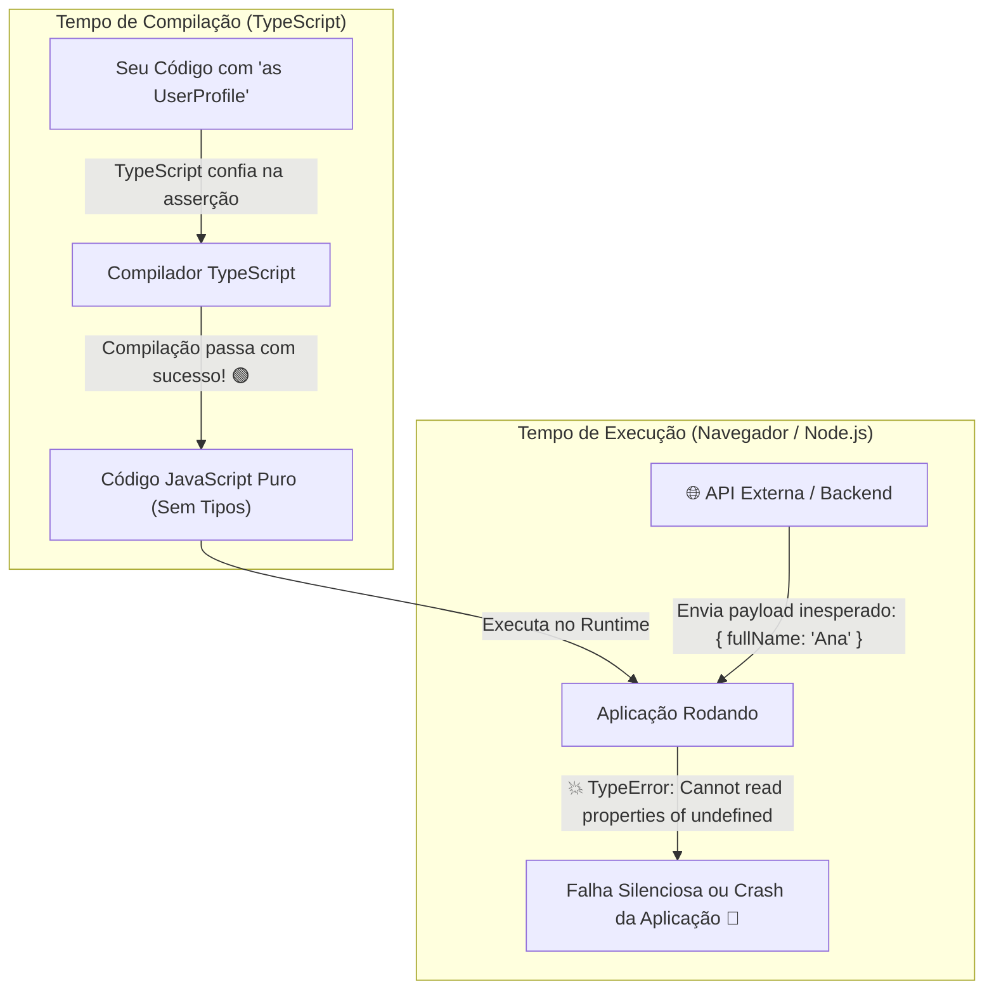
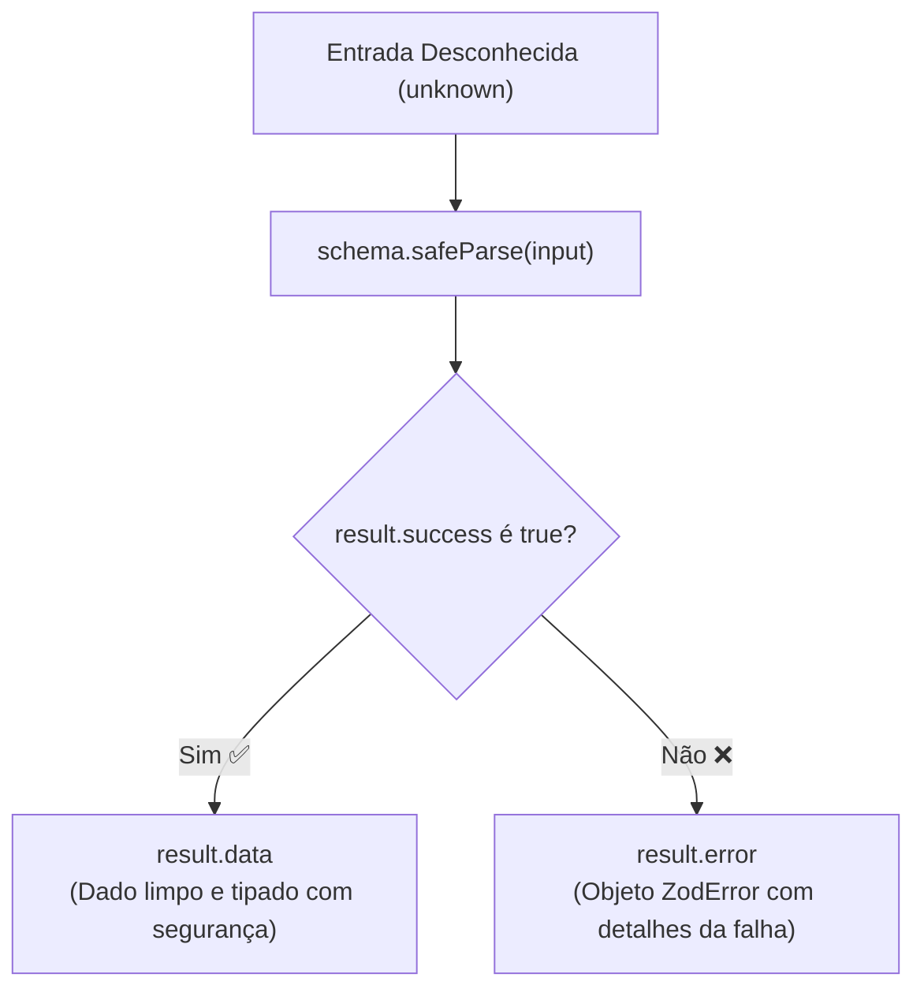

# 01. O Problema do Runtime e Introdução ao Zod

No **Módulo 01**, dominamos os fundamentos do TypeScript: interfaces, type
aliases, uniões discriminadas e checagem estática de tipos. Aprendemos que o
compilador do TypeScript é um aliado incrivelmente poderoso para prevenir erros
de digitação e garantir a consistência do código durante o desenvolvimento.

No entanto, existe uma fronteira crítica que todo desenvolvedor web precisa
compreender:

> **O TypeScript só existe em tempo de compilação. Em tempo de execução
> (_runtime_), todos os tipos são completamente apagados.**

Quando a sua aplicação recebe dados do mundo externo — como a resposta de uma
requisição `fetch()`, dados digitados por um usuário em um formulário, variáveis
de ambiente do sistema ou arquivos lidos do disco —, o motor JavaScript (V8) não
sabe e não se importa com as interfaces que você escreveu.

Neste capítulo, você entenderá a armadilha do _Type Assertion_ cego, descobrirá
o que é o **Zod** e aprenderá a validar dados reais na porta de entrada da sua
aplicação.

## A Armadilha: A Falsa Segurança do `as Tipo`

Considere um cenário extremamente comum: você definiu um tipo para representar o
perfil de um usuário e consome uma API externa:

```typescript
type UserProfile = {
  id: number;
  name: string;
  email: string;
};

async function fetchUserProfile(userId: number): Promise<UserProfile> {
  const response = await fetch(`https://api.example.com/users/${userId}`);

  // ❌ Type Assertion perigoso: o compilador acredita cegamente, mas NADA foi validado!
  const data = (await response.json()) as UserProfile;

  return data;
}
```

O que acontece se a API:

1. Sofrer uma alteração no backend e renomear o campo `name` para `fullName`?
2. Retornar um erro HTTP `{ "error": "Not Found" }` com status 404?
3. Retornar `id` como uma string `"usr_123"` em vez de número?

O TypeScript não acusará **nenhum erro** durante a compilação, pois o operador
`as UserProfile` força o compilador a "confiar" na asserção. No entanto, quando
o código rodar no navegador do usuário:

```typescript
const user = await fetchUserProfile(10);

// 💥 Erro em runtime se a API mudou o contrato:
console.log(user.name.toUpperCase());
// TypeError: Cannot read properties of undefined (reading 'toUpperCase')
```



## A Solução: O Que é o Zod?

O **Zod** é uma biblioteca de declaração e validação de schemas em TypeScript
que opera no **tempo de execução (_runtime_)**.

Em vez de apenas declarar tipos que desaparecem após o build, com o Zod você
define **schemas** (regras formais de validação). O Zod então atua como um
"segurança na porta de entrada" dos seus dados:

1. **Validação Rigorosa:** Inspeciona os dados recebidos em tempo de execução e
   verifica se eles respeitam rigorosamente a estrutura esperada.
2. **Inferência Estática Automática:** A partir do próprio schema de validação,
   o Zod gera automaticamente os tipos estritos do TypeScript, sem você precisar
   duplicar definições.
3. **Tratamento Elegante de Erros:** Fornece mensagens descritivas detalhando
   exatamente quais campos falharam e por quê.

## Instalação e Requisitos

Para adicionar o Zod ao seu projeto, execute o comando correspondente no seu
gerenciador de pacotes:

```bash
npm install zod
```

> O Zod requer o modo estrito do TypeScript habilitado. Certifique-se de que o
> seu arquivo `tsconfig.json` contenha `"strict": true` (ou `"strictNullChecks": true`).

## Criando seu Primeiro Schema Primitivo

Para começar a usar o Zod, importamos o objeto `z` do pacote:

```typescript
import { z } from "zod";

// 1. Definindo um schema para validar strings
const UserNameSchema = z.string();

// 2. Definindo um schema para validar números
const UserAgeSchema = z.number();
```

Um schema no Zod é uma instância que possui métodos capazes de receber qualquer
valor desconhecido (`unknown`) e validar se ele atende às regras declaradas.

## Métodos de Validação: `.parse()` vs. `.safeParse()`

O Zod oferece duas abordagens principais para validar dados:

### 1. Validação com `.parse()` (Lança Exceção)

O método `.parse()` recebe um dado e tenta validá-lo. Se o dado for válido, ele
o retorna com a tipagem correta. Se o dado for inválido, o Zod **lança uma
exceção** do tipo `ZodError`:

```typescript
import { z } from "zod";

const AgeSchema = z.number();

// ✅ Sucesso: retorna o número 25 com tipo 'number'
const validAge = AgeSchema.parse(25);
console.log(validAge); // 25

try {
  // ❌ Falha: lança ZodError
  const invalidAge = AgeSchema.parse("vinte e cinco");
} catch (error) {
  if (error instanceof z.ZodError) {
    console.error("Dado inválido!", error.issues);
  }
}
```

O método `.parse()` é ideal para situações onde a falha de validação representa
uma condição excepcional na qual a execução deve ser imediatamente interrompida
(por exemplo, ao validar variáveis de ambiente críticas no startup do servidor).

### 2. Validação com `.safeParse()` (Result Pattern)

Quando estamos lidando com entradas de formulários ou respostas de rede onde
falhas são esperadas e devem ser tratadas de forma controlada, o método
`.safeParse()` é a abordagem mais recomendada.

O `.safeParse()` **nunca lança exceções**. Em vez disso, ele retorna um objeto
baseado no padrão _Result_ (uma união discriminada pelo campo `success`):

```typescript
import { z } from "zod";

const ScoreSchema = z.number();

function processUserScore(input: unknown) {
  const result = ScoreSchema.safeParse(input);

  if (!result.success) {
    // 🔴 O TypeScript afunila (narrows) 'result' para { success: false, error: ZodError }
    console.error("Validação falhou:", result.error.issues);
    return;
  }

  // 🟢 O TypeScript afunila (narrows) 'result' para { success: true, data: number }
  console.log("Pontuação válida:", result.data);
}

processUserScore(100); // ✅ Pontuação válida: 100
processUserScore("inválido"); // 🔴 Validação falhou: [...]
```



<details>
<summary>🔍 <strong>Aprofundamento: Por que não usar validações manuais com typeof e if?</strong></summary>

Você pode se perguntar: _"Não poderíamos apenas escrever condicionais manuais
com `typeof`?"_

```typescript
// ❌ Validação manual: prolixa, frágil e sem inferência de tipos em cascata
function isUserProfile(data: unknown): boolean {
  if (typeof data !== "object" || data === null) return false;

  const obj = data as Record<string, unknown>;
  return (
    typeof obj.id === "number" &&
    typeof obj.name === "string" &&
    typeof obj.email === "string"
  );
}
```

Escrever validações manuais com `typeof` para modelos com dezenas de campos,
objetos aninhados, listas e regras de negócio (como e-mails válidos ou tamanhos
mínimos) é:

- Extremamente trabalhoso e sujeito a erros humanos;
- Difícil de manter (qualquer campo novo exige atualizar a interface e a função
  de checagem manualmente);
- Incapaz de gerar mensagens de erro estruturadas e intuitivas sem centenas de
  linhas de código boilerplate.

O Zod elimina completamente essa dor ao combinar validação declarativa de alta
performance com integração nativa ao sistema de tipos do TypeScript.

</details>

## O Que Vem a Seguir?

Agora que entendemos a necessidade fundamental de validar dados em runtime e
como o Zod opera, no próximo capítulo exploraremos o **catálogo completo de
schemas primitivos**, os validadores específicos para strings e números (como
`.email()`, `.min()`, `.max()`) e o recurso de **coerção automática de tipos**
(`z.coerce`).

---

<a
href="../../02-a-plataforma-web-moderna/seguranca-e-sessao/03-armazenamento-de-tokens-e-seguranca-no-frontend.md">←
Armazenamento de Tokens e Segurança no Frontend</a>

<p align="right"><a href="02-schemas-primitivos-validacoes-e-coercao.md">Próximo: Schemas Primitivos, Validações e Coerção →</a></p>
