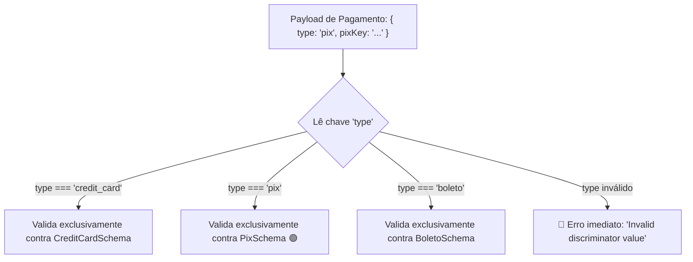

# 04. Unions, Enums e Discriminated Unions

No **Módulo 01 (Capítulo 24)**, aprendemos que muitas regras de negócio na Web
não são modeladas apenas por formatos livres de strings ou números, mas por
**conjuntos finitos de opções** (como status de pedidos, papéis de usuários ou
métodos de pagamento polimórficos).

No TypeScript estático, usamos uniões literais (`"pendente" | "pago" |
"cancelado"`) e uniões discriminadas para criar contratos seguros. No entanto,
quando os dados chegam de requisições HTTP externas, o TypeScript não pode
garantir que o valor recebido pertence realmente a esse conjunto permitido.

Neste capítulo, você aprenderá a validar valores literais e enums em tempo de
execução com o **Zod**, entenderá o funcionamento de `z.union()` e dominará o
padrão de alta performance das **Discriminated Unions**
(`z.discriminatedUnion()`).

## Tipos Literais (`z.literal`)

O método `z.literal()` valida se um dado corresponde **exatamente** a um valor
primitivo específico (seja uma string, número ou boolean):

```typescript
import { z } from "zod";

const ProtocolSchema = z.literal("https");
const SuccessCodeSchema = z.literal(200);
const ConfirmedSchema = z.literal(true);

console.log(ProtocolSchema.safeParse("https").success); // true  ✅
console.log(ProtocolSchema.safeParse("http").success); // false ❌ (esperava exatamente "https")
```

Tipos literais são essenciais quando combinados com objetos para atuar como
marcadores de versão, constantes de configuração ou campos identificadores de
tipo.

## Conjuntos Enumerados (`z.enum` e `z.nativeEnum`)

Quando uma propriedade aceita apenas um conjunto fixo de strings, o `z.enum()` é
a abordagem recomendada e mais idiomática do ecossistema:

```typescript
import { z } from "zod";

// 1. Declarando o schema de enum
const OrderStatusSchema = z.enum([
  "pending",
  "processing",
  "shipped",
  "delivered",
  "canceled",
]);

// 2. Inferindo o tipo TypeScript estrito
type OrderStatus = z.infer<typeof OrderStatusSchema>;
// type OrderStatus = "pending" | "processing" | "shipped" | "delivered" | "canceled"
```

O `z.enum()` também expõe a propriedade `.enum` para que você possa referenciar
as opções no seu código TypeScript com autocompletar seguro:

```typescript
const nextStatus: OrderStatus = OrderStatusSchema.enum.shipped; // "shipped"
```

### Integração com Enums Clássicos do TypeScript (`z.nativeEnum`)

Se o seu projeto já utiliza a palavra-chave `enum` nativa do TypeScript, o Zod
oferece compatibilidade total através de `z.nativeEnum()`:

```typescript
enum UserRole {
  Admin = "ADMIN",
  Editor = "EDITOR",
  Viewer = "VIEWER",
}

const UserRoleSchema = z.nativeEnum(UserRole);

type Role = z.infer<typeof UserRoleSchema>;
// type Role = UserRole
```

## Uniões Simples (`z.union` ou `.or()`)

Quando um dado pode assumir múltiplos tipos válidos, utilizamos uniões:

```typescript
import { z } from "zod";

// Abordagem 1: z.union()
const IdSchema = z.union([z.string(), z.number()]);

// Abordagem 2: Método fluente .or() (Sintaxe idêntica)
const FlexibleIdSchema = z.string().or(z.number());

type Id = z.infer<typeof IdSchema>;
// type Id = string | number
```

### O Problema do `z.union` em Objetos Complexos

Ao usar `z.union()` com múltiplos schemas de objetos complexos, o Zod precisa
testar o dado recebido contra cada um dos schemas da lista sequencialmente. Se a
validação falhar, o Zod acumula os erros de **todos os schemas testados**,
resultando em mensagens de erro gigantescas e confusas:

```typescript
// ❌ z.union() genérico com objetos: mensagens de erro prolixas e custo O(N)
const PaymentUnionSchema = z.union([
  CreditCardPaymentSchema,
  PixPaymentSchema,
  BoletoPaymentSchema,
]);
```

Para resolver esse problema com máxima performance e mensagens de erro
cirúrgicas, utilizamos as **Discriminated Unions**.

## O Padrão de Ouro: Discriminated Unions (`z.discriminatedUnion`)

Uma **Discriminated Union** (União Discriminada) é uma coleção de schemas de
objetos onde **todos os objetos compartilham uma propriedade em comum com valor
literal único** (o discriminador, geralmente chamado de `type`, `kind` ou
`status`).

Em vez de testar todos os schemas sequencialmente, o Zod inspeciona o valor da
propriedade discriminadora e vai **direto ao schema correto em tempo $O(1)$**:

```typescript
import { z } from "zod";

// 1. Schema para Pagamento via Cartão de Crédito
const CreditCardSchema = z.object({
  type: z.literal("credit_card"),
  cardNumber: z.string().length(16),
  cvv: z.string().length(3),
  installments: z.number().int().positive(),
});

// 2. Schema para Pagamento via Pix
const PixSchema = z.object({
  type: z.literal("pix"),
  pixKey: z.string().min(1),
  qrCode: z.string().url(),
});

// 3. Schema para Pagamento via Boleto Bancário
const BoletoSchema = z.object({
  type: z.literal("boleto"),
  barCode: z.string().length(47),
  dueDate: z.coerce.date(),
});

// 4. União Discriminada usando a propriedade "type" como chave
const PaymentSchema = z.discriminatedUnion("type", [
  CreditCardSchema,
  PixSchema,
  BoletoSchema,
]);

// 5. Inferência do tipo polimórfico
type Payment = z.infer<typeof PaymentSchema>;
```



### Consumindo Dados com Afunilamento Seguro no TypeScript

Ao inferir o tipo com `z.infer`, o compilador do TypeScript ganha o poder de
fazer **afunilamento automático (_type narrowing_)** baseado no discriminador
`type`:

```typescript
function processPayment(payment: Payment) {
  switch (payment.type) {
    case "credit_card":
      // 🟢 O TypeScript sabe que existem 'cardNumber' e 'installments'
      console.log(
        `Cobrando cartão ${payment.cardNumber} em ${payment.installments}x`,
      );
      break;

    case "pix":
      // 🟢 O TypeScript sabe que existem 'pixKey' e 'qrCode'
      console.log(`Gerando Pix para chave: ${payment.pixKey}`);
      break;

    case "boleto":
      // 🟢 O TypeScript sabe que existem 'barCode' e 'dueDate'
      console.log(
        `Emitindo boleto com vencimento em: ${payment.dueDate.toISOString()}`,
      );
      break;
  }
}
```

<details>
<summary>🔍 <strong>Aprofundamento: Requisitos para a Chave Discriminadora</strong></summary>

Para utilizar o `z.discriminatedUnion(discriminator, schemas)` com sucesso:

1. **A chave deve existir em todos os schemas:** Toda estrutura passada no array
   precisa declarar a propriedade discriminadora escolhida (ex.: `"type"`).
2. **O valor da chave deve ser um `z.literal()`:** A propriedade discriminadora
   não pode ser uma `z.string()` genérica; ela deve ser definida com
   `z.literal("valor_exato")` em cada schema para permitir a identificação
   estática.

</details>

## O Que Vem a Seguir?

Neste capítulo, aprendemos a modelar estados finitos com `z.enum`, uniões
flexíveis e estruturas polimórficas de alta performance com
`z.discriminatedUnion`.

No próximo capítulo, exploraremos como criar **regras de negócio
personalizadas** com `.refine()` (como validação de senhas iguais ou CPF) e como
higienizar dados em tempo de execução com **transformações (`.transform()`)**.

---

<a href="03-objetos-arrays-e-inferencia-de-tipos.md">← Objetos, Arrays e
Inferência de Tipos</a>

<p align="right"><a href="05-refinamentos-e-transformacoes.md">Próximo: Refinamentos e Transformações →</a></p>
