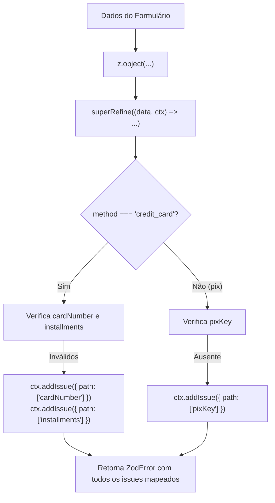

# 05. Refinamentos e Transformações

Nos capítulos anteriores, aprendemos a validar tipos primitivos, formatos
padronizados, objetos e uniões discriminadas. Esses validadores cobrem com
precisão a **estrutura e o formato** dos dados.

No entanto, sistemas web reais estão repletos de **regras de negócio dinâmicas e
contextuais**:

- Um formulário de cadastro exige que os campos `password` e `confirmPassword`
  sejam exatamente iguais;
- Uma data de agendamento de consulta precisa ser obrigatoriamente posterior ao
  momento atual;
- Um documento (como CPF ou CNPJ) precisa ser submetido ao cálculo de dígitos
  verificadores;
- Uma entrada de texto precisa ser higienizada (como remover traços e pontos de
  um CEP) ou convertida em uma entidade mais rica antes de ser consumida pela
  aplicação.

Neste capítulo, você aprenderá a sanitizar e converter dados em tempo de
execução com **Transformações (`.transform()`)**, criará regras de negócio
personalizadas com **`.refine()`** e dominará o controle fino de erros
contextuais com **`.superRefine()`**.

## Transformações de Dados (`.transform()`)

O método `.transform()` permite alterar o valor ou o tipo do dado durante o
processo de parsing. Ele é executado após as validações anteriores terem passado
com sucesso:

### 1. Sanitização e Limpeza de Dados

Imagine um campo de formulário onde o usuário digita um CEP com máscara
(`"01310-100"`), mas o seu banco de dados exige apenas os 8 dígitos numéricos
(`"01310100"`):

```typescript
import { z } from "zod";

const CleanZipCodeSchema = z
  .string()
  .transform((rawText) => rawText.replace(/\D/g, "")) // Remove tudo o que não for dígito
  .pipe(
    z.string().length(8, "O CEP deve conter exatamente 8 dígitos numéricos."),
  );

const clean = CleanZipCodeSchema.parse("01310-100");
console.log(clean); // ✅ Saída: "01310100"
```

> O método `.pipe()` permite encadear outro schema do Zod para validar o
> resultado gerado pela transformação.

### 2. Conversão de Tipos com `.transform()`

Podemos transformar uma string de data ISO em uma instância nativa de `Date`:

```typescript
import { z } from "zod";

const IsoToDateSchema = z.iso
  .datetime()
  .transform((isoString) => new Date(isoString));

const parsedDate = IsoToDateSchema.parse("2026-09-08T20:00:00Z");
console.log(parsedDate instanceof Date); // ✅ true
```

Ao inspecionar a tipagem com `z.input` e `z.infer`:

- `z.input<typeof IsoToDateSchema>` $\rightarrow$ `string` (o dado que entra no
  `.parse()`);
- `z.infer<typeof IsoToDateSchema>` $\rightarrow$ `Date` (o dado pronto e
  transformado que sai do `.parse()`).

## Validações Customizadas com `.refine()`

Quando um schema nativo do Zod não cobre uma regra de negócio específica,
utilizamos o método `.refine()`. Ele recebe uma função de predicado que deve
retornar `true` (válido) ou `false` (inválido):

### 1. Validação de Regra em Campo Único

```typescript
import { z } from "zod";

// Validando que uma data de agendamento deve ser estritamente no futuro
const FutureDateSchema = z.coerce
  .date()
  .refine((appointmentDate) => appointmentDate > new Date(), {
    message: "A data do agendamento deve ser posterior à data e hora atuais.",
  });

console.log(FutureDateSchema.safeParse(new Date("2020-01-01")).success); // false ❌
console.log(FutureDateSchema.safeParse(new Date("2099-01-01")).success); // true  ✅
```

### 2. Validação Multi-Campo em Objetos (Confirmação de Senha)

Um dos casos de uso mais famosos do `.refine()` é validar campos
interdependentes em um objeto, como a confirmação de senha em formulários de
registro:

```typescript
import { z } from "zod";

const SignUpFormSchema = z
  .object({
    name: z.string().min(3, "Nome muito curto."),
    email: z.email("E-mail inválido."),
    password: z.string().min(8, "A senha deve ter no mínimo 8 caracteres."),
    confirmPassword: z.string(),
  })
  .refine((formData) => formData.password === formData.confirmPassword, {
    message: "As senhas informadas não conferem.",
    path: ["confirmPassword"], // 🎯 Crucial: direciona o erro exatamente para o campo 'confirmPassword'
  });

type SignUpFormData = z.infer<typeof SignUpFormSchema>;
```

#### Por que o parâmetro `path` é crucial?

Sem a propriedade `path: ["confirmPassword"]`, o Zod associaria o erro à **raiz
do objeto**. Ao definir `path`, o erro fica explicitamente atrelado à chave do
campo, permitindo que bibliotecas de formulário no frontend (como React Hook
Form) destaquem a borda vermelha e a mensagem de erro exatamente sob o input de
confirmação de senha!

```typescript
const result = SignUpFormSchema.safeParse({
  name: "Lucas",
  email: "lucas@fatec.sp.gov.br",
  password: "senhaSegura123",
  confirmPassword: "outraSenhaIncorreta",
});

if (!result.success) {
  console.log(result.error.issues[0]);
  // Saída:
  // {
  //   code: 'custom',
  //   message: 'As senhas informadas não conferem.',
  //   path: [ 'confirmPassword' ] // 🎯
  // }
}
```

## Controle Fino com `.superRefine()`

Enquanto o `.refine()` retorna um simples booleano (`true`/`false`) para uma
única mensagem de erro, o método `.superRefine()` dá acesso direto ao **contexto
de refinamento (`RefinementCtx`)**.

Com ele, você pode inspecionar os dados e disparar **múltiplos erros
independentes com caminhos (`path`) e códigos específicos**:

```typescript
import { z } from "zod";

const PaymentFormSchema = z
  .object({
    method: z.enum(["credit_card", "pix"]),
    cardNumber: z.string().optional(),
    installments: z.number().optional(),
    pixKey: z.string().optional(),
  })
  .superRefine((formData, ctx) => {
    // 1. Regra condicional para Cartão de Crédito
    if (formData.method === "credit_card") {
      if (!formData.cardNumber || formData.cardNumber.length !== 16) {
        ctx.addIssue({
          code: z.ZodIssueCode.custom,
          message: "O número do cartão de crédito deve conter 16 dígitos.",
          path: ["cardNumber"],
        });
      }

      if (!formData.installments || formData.installments < 1) {
        ctx.addIssue({
          code: z.ZodIssueCode.custom,
          message: "Selecione a quantidade de parcelas.",
          path: ["installments"],
        });
      }
    }

    // 2. Regra condicional para Pix
    if (formData.method === "pix" && !formData.pixKey) {
      ctx.addIssue({
        code: z.ZodIssueCode.custom,
        message: "A chave Pix é obrigatória para este método.",
        path: ["pixKey"],
      });
    }
  });
```



<details>
<summary>🔍 <strong>Aprofundamento: A Ordem de Execução no Pipeline do Zod</strong></summary>

Quando você encadeia múltiplos métodos em um schema, o Zod executa as etapas
rigorosamente na seguinte ordem sequencial:

$$
\text{Entrada Bruta} \xrightarrow{\text{1. Coerce}} \text{Conversão Nativa}
\xrightarrow{\text{2. Schema Base}} \text{Validação de Tipo}
\xrightarrow{\text{3. Refine}} \text{Regras Customizadas} \xrightarrow{\text{4.
Transform}} \text{Saída Limpa}
$$

Se qualquer uma das etapas anteriores falhar, o pipeline é interrompido para
aquele campo e as etapas subsequentes (como `.transform()`) não são executadas,
garantindo que suas funções de transformação sempre recebam dados garantidamente
válidos.

</details>

## O Que Vem a Seguir?

Neste capítulo, aprendemos a implementar regras de negócio avançadas, validações
multi-campo com direcionamento de `path` e transformações de dados em runtime.

No próximo e último capítulo deste módulo, aprenderemos a inspecionar e formatar
o **`ZodError`** para interfaces web modernas com `error.flatten()` e
exploraremos dois casos de uso vitais da indústria: **consumo tipado de APIs com
`fetch()`** e **validação _fail-fast_ de variáveis de ambiente**.

---

<a href="04-unions-enums-e-discriminated-unions.md">← Unions, Enums e
Discriminated Unions</a>

<p align="right"><a href="06-tratamento-de-erros-e-casos-reais.md">Próximo: Tratamento de Erros e Casos Reais →</a></p>
