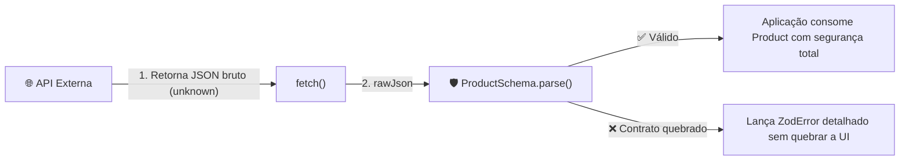

# 06. Tratamento de Erros e Casos Reais

Chegamos ao capítulo de consolidação do módulo **Zod**. Ao longo desta jornada,
aprendemos a declarar schemas primitivos, modelar objetos complexos, extrair
tipos com `z.infer`, criar uniões discriminadas e implementar regras de negócio
com refinamentos e transformações.

No entanto, o valor supremo do Zod na engenharia de software reside em como ele
se integra aos desafios do dia a dia em produção:

1. **Interfaces Web Amigáveis:** Como traduzir erros técnicos de validação em
   mensagens elegantes para o usuário final em formulários;
2. **Consumo Seguro de APIs:** Como blindar requisições `fetch()` contra
   alterações inesperadas de contratos no backend;
3. **Segurança no Startup (_Fail-Fast_):** Como impedir que a aplicação suba em
   produção com variáveis de ambiente ausentes ou incorretas.

Neste capítulo, você dominará a anatomia do **`ZodError`**, aprenderá a formatar
erros com **`error.flatten()`** e implementará dois dos padrões arquiteturais
mais adotados pela indústria moderna.

## Anatomia do `ZodError` e `ZodIssue`

Sempre que a validação do Zod falha (seja via exceção no `.parse()` ou no campo
`result.error` do `.safeParse()`), recebemos uma instância de `ZodError`.

O `ZodError` contém um array chamado `issues`, onde cada item descreve
minuciosamente um problema encontrado:

```typescript
import { z } from "zod";

const UserSchema = z.object({
  name: z.string().min(3),
  age: z.number().int().positive(),
  email: z.email(),
});

const result = UserSchema.safeParse({
  name: "Al",
  age: -5,
  email: "nao-e-email",
});

if (!result.success) {
  console.log(result.error.issues);
}
```

Cada `ZodIssue` possui a seguinte estrutura:

```typescript
{
  code: 'too_small',
  minimum: 3,
  type: 'string',
  inclusive: true,
  exact: false,
  message: 'String must contain at least 3 character(s)',
  path: [ 'name' ] // 🎯 O caminho exato da propriedade com problema
}
```

- **`path`:** Array indicando a localização exata do campo com erro (útil para
  objetos e arrays aninhados, como `["users", 0, "address", "zipCode"]`);
- **`code`:** Identificador do tipo de falha (`"invalid_type"`, `"too_small"`,
  `"too_big"`, `"custom"`, etc.);
- **`message`:** Mensagem descritiva do erro.

## Formatando Erros para Formulários com `error.flatten()`

Iterar manualmente sobre `error.issues` para mapear erros em telas de formulário
pode ser trabalhoso. Para resolver isso, o Zod fornece o método
**`error.flatten()`**.

O `.flatten()` converte a árvore de erros em um formato simplificado:

- **`fieldErrors`:** Dicionário onde cada chave é o nome do campo e o valor é um
  array com as mensagens de erro daquele campo;
- **`formErrors`:** Array de erros gerais atrelados à raiz do formulário (como
  falhas no `.refine()` sem `path`).

```typescript
import { z } from "zod";

const LoginFormSchema = z.object({
  email: z.email("Informe um e-mail válido."),
  password: z.string().min(8, "A senha deve ter no mínimo 8 caracteres."),
});

const result = LoginFormSchema.safeParse({
  email: "email-invalido",
  password: "123",
});

if (!result.success) {
  const flattened = result.error.flatten();

  console.log(flattened.fieldErrors);
  // ✅ Saída estruturada ideal para o Frontend:
  // {
  //   email: [ 'Informe um e-mail válido.' ],
  //   password: [ 'A senha deve ter no mínimo 8 caracteres.' ]
  // }

  // No React ou Vanilla JS, você pode exibir diretamente no input:
  const emailErrorMessage = flattened.fieldErrors.email?.[0];
  console.log(emailErrorMessage); // "Informe um e-mail válido."
}
```

## Caso Real 1: Consumo Seguro de APIs (`fetch` + Zod)

No **Módulo 02**, aprendemos a consumir APIs HTTP com `fetch()`. Combinando
`fetch()` com Zod, eliminamos qualquer incerteza sobre o formato dos dados
retornados pelo backend:

```typescript
import { z } from "zod";

// 1. Schema do Contrato esperado da API
const ProductSchema = z.object({
  id: z.number(),
  title: z.string(),
  price: z.number().positive(),
  category: z.string(),
});

type Product = z.infer<typeof ProductSchema>;

// 2. Função genérica de consumo com validação em runtime
async function fetchSafe<T>(url: string, schema: z.ZodType<T>): Promise<T> {
  const response = await fetch(url);

  if (!response.ok) {
    throw new Error(`Erro HTTP ${response.status}: ${response.statusText}`);
  }

  const rawJson: unknown = await response.json();

  // 🛡️ O Zod valida e garante a tipagem estrita de retorno!
  return schema.parse(rawJson);
}

// 3. Uso em produção
async function loadProduct(productId: number) {
  try {
    const product = await fetchSafe(
      `https://fakestoreapi.com/products/${productId}`,
      ProductSchema,
    );

    // 🟢 Tipagem 100% garantida pelo Zod em runtime e pelo TypeScript na compilação
    console.log(`Produto: ${product.title} - R$ ${product.price.toFixed(2)}`);
  } catch (error) {
    if (error instanceof z.ZodError) {
      console.error(
        "A API retornou dados com contrato inválido!",
        error.flatten(),
      );
    } else {
      console.error("Falha na requisição de rede:", error);
    }
  }
}
```



## Caso Real 2: Validação _Fail-Fast_ de Variáveis de Ambiente

Um dos erros mais frustrantes na Web é fazer o deploy de uma aplicação e
descobrir horas depois que ela falhou porque uma variável de ambiente essencial
(como `API_URL` ou `DATABASE_URL`) não foi configurada no servidor.

Com o padrão **_Fail-Fast_ (Falha Rápida)**, criamos um arquivo centralizador
(`env.ts`) que valida todas as variáveis de ambiente na inicialização da
aplicação:

```typescript
import { z } from "zod";

// 1. Definindo o schema das variáveis de ambiente necessárias
const EnvSchema = z.object({
  NODE_ENV: z
    .enum(["development", "test", "production"])
    .default("development"),
  PORT: z.coerce.number().int().positive().default(3000),
  DATABASE_URL: z
    .string()
    .url("A DATABASE_URL deve ser uma URL válida de conexão."),
  API_SECRET_KEY: z
    .string()
    .min(16, "A chave de API deve ter pelo menos 16 caracteres."),
  ENABLE_ANALYTICS: z.coerce.boolean().default(false),
});

// 2. Validando process.env (Node.js) ou import.meta.env (Vite/Front)
const envResult = EnvSchema.safeParse(process.env);

if (!envResult.success) {
  console.error("❌ Configuração inválida de variáveis de ambiente:");
  console.error(envResult.error.flatten().fieldErrors);

  // Interrompe imediatamente o processo antes que qualquer serviço quebre
  process.exit(1);
}

// 3. Exportando o objeto tipado e garantidamente válido
export const env = envResult.data;
```

Ao importar `env` em qualquer outro arquivo do projeto, você tem autocompletar
perfeito, tipos corretos (números como `number`, booleans como `boolean`) e a
certeza absoluta de que a aplicação nunca rodará com configurações corrompidas.

<details>
<summary>🔍 <strong>Aprofundamento: Tradução Global de Erros (i18n) no Zod</strong></summary>

Se a sua aplicação possui centenas de schemas e você não deseja personalizar
mensagens manualmente em cada campo, é possível registrar um mapa global de
erros utilizando `z.setErrorMap()`:

```typescript
import { z } from "zod";

const customErrorMap: z.ZodErrorMap = (issue, ctx) => {
  if (issue.code === z.ZodIssueCode.invalid_type) {
    if (issue.received === "undefined") {
      return { message: "Este campo é obrigatório." };
    }
  }

  if (issue.code === z.ZodIssueCode.too_small && issue.type === "string") {
    return { message: `Deve conter no mínimo ${issue.minimum} caracteres.` };
  }

  return { message: ctx.defaultError };
};

// Aplica o mapa para todos os schemas do projeto
z.setErrorMap(customErrorMap);
```

No ecossistema NPM, também existe o pacote dedicado `zod-i18n-map` que provê
traduções completas para mais de 30 idiomas.

</details>

---

<a href="05-refinamentos-e-transformacoes.md">← Refinamentos e
Transformações</a>
